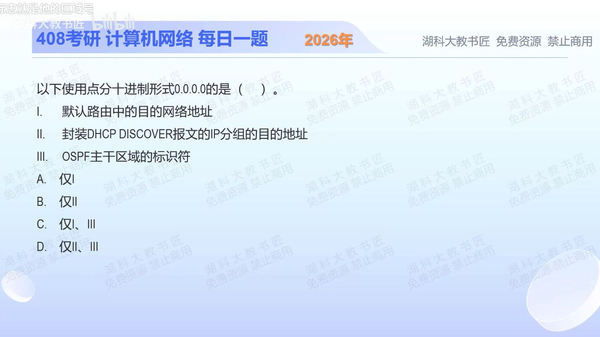

[目录](README.md)　·　[2025-0907 »](0907.md)

# 2025-09-06

[原视频](https://www.bilibili.com/video/BV1Btayz9EUi/)

<!-- review-lesson -->

## 先合上解析

不看解析：分别写出默认路由的前缀、首次DHCP发现的源/目的IPv4地址、OSPF骨干区域编号。三处的0各在表示什么？

展开解析与逐项判断

先把“0.0.0.0”放回它所在的位置：同样的写法可能是网络前缀、主机尚未配置地址时的源地址，也可能只是区域编号。

Ⅰ成立。默认路由写作 `0.0.0.0/0`，掩码没有要求匹配的位，因而作为没有更具体路由时的后备。不能漏掉 `/0`，单独一个地址不能说明整条路由。

Ⅱ不成立。初次发现服务器时，客户端没有可用IPv4地址，通常以 `0.0.0.0` 为**源地址**，以 `255.255.255.255` 为**目的地址**广播。这里把源和目的换了。

Ⅲ成立。OSPF骨干区域的Area ID为0，可写作 `0.0.0.0`；这是区域标识，不是给骨干网每台主机分配的IP。故选 **C（仅Ⅰ、Ⅲ）**。A漏掉Ⅲ；B、D均误收Ⅱ。

只核对复盘检查

默认前缀0.0.0.0/0；首次发现源0.0.0.0、目的255.255.255.255；Area ID为0。先看字段角色，再解释数值。

## 换一个条件

把Ⅱ的“目的地址”改为“源地址”，仍限定尚未取得地址的首次发现；现在Ⅰ—Ⅲ哪些成立？

完成后核对

三项都成立。变化只在源/目的角色，不要把“0.0.0.0一律不能使用”背成规则。

关联：[DHCP发送者](0907.md) → [四步顺序](0909.md)；[真题网络服务](../../src/1002.md)。

取证边界：[RFC 2131 §4.4.1](https://www.rfc-editor.org/rfc/rfc2131.html#section-4.4.1)；[RFC 2328 §6](https://www.rfc-editor.org/rfc/rfc2328.html#section-6)。

[复习入口](../../review/README.md) · 解析已补全，个人是否掌握以独立作答为准。
