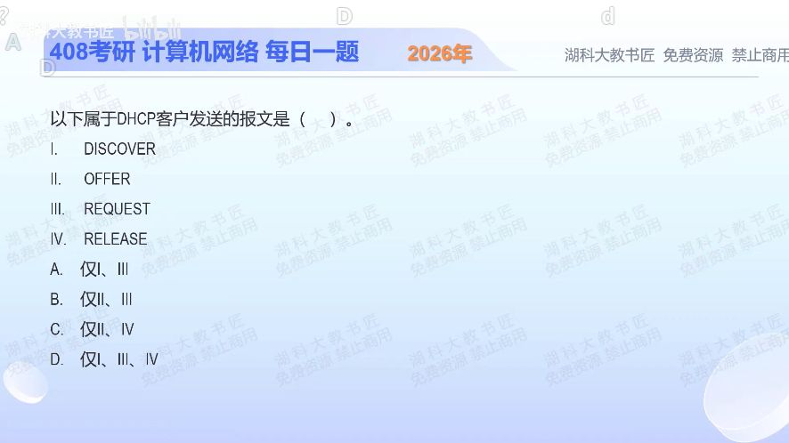

[目录](README.md)　·　[« 2025-0906](0906.md)　·　[2025-0908 »](0908.md)

# 2025-09-07

[原视频](https://www.bilibili.com/video/BV19ra2zXE8j/)

<!-- review-lesson -->

## 先合上解析

给DISCOVER、OFFER、REQUEST、RELEASE分别标上客户端C或服务器S；再解释为何RELEASE不是服务器发出的回收通知。

展开解析与逐项判断

先问谁在申请地址。客户端提出需求，服务器给出可用配置；最后客户端还可以主动释放租约。

DISCOVER是客户端“找服务器”；OFFER是服务器“提供方案”；REQUEST是客户端“请求采用方案”；RELEASE是客户端“不再使用租约”。因此Ⅰ、Ⅲ、Ⅳ由客户端发送，选 **D**。A漏了释放；B错误地包含OFFER；C既包含OFFER又漏掉发现和请求。

“由谁发”与“是不是广播”是两件事。客户端首次发现通常广播，而释放报文通常单播给原服务器；不能凭广播/单播去猜客户端/服务器。

只核对复盘检查

C、S、C、C。RELEASE表示客户端主动交还自己正在使用的租约。

## 换一个条件

把RELEASE换成ACK，哪些报文由客户端发送？

完成后核对

只剩DISCOVER和REQUEST，即Ⅰ、Ⅲ。ACK是服务器确认配置；报文在流程的最后不代表由客户端发送。

关联：[地址角色](0906.md)；[把发送者接成顺序](0909.md)。

[复习入口](../../review/README.md) · 解析已补全，个人是否掌握以独立作答为准。
