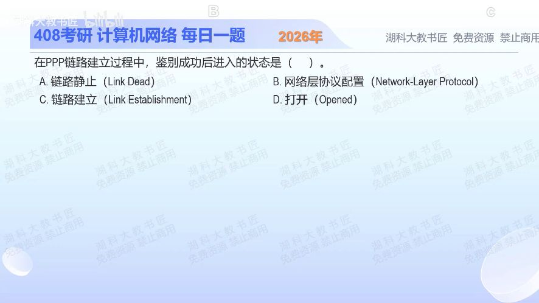

[目录](README.md)　·　[« 2025-0907](0907.md)　·　[2025-0909 »](0909.md)

# 2025-09-08

[原视频](https://www.bilibili.com/video/BV1Jha2zhEDC/)

<!-- review-lesson -->

## 先合上解析

按因果补齐：链路建立 → 可选鉴别 → ？ → 可以传送相应网络层分组。鉴别成功还缺哪类配置？

展开解析与逐项判断

题目已经给出“鉴别成功”，先划掉仍在鉴别之前的状态。PPP先建立链路并用LCP协商，再按需鉴别身份；身份确认以后，还要用NCP配置要承载的网络层协议，配置成功才进入能够传送相应网络层分组的阶段。

所以此刻进入**网络层协议配置，选B**。A是链路不可用的静止阶段；C是前面的链路建立；D跳过了网络层配置。这里“链路已经建立”不等于“网络层参数已经可用”。

按题目的教学状态划分判断即可。RFC里LCP有限状态机的Opened与整条PPP链路阶段不是同一个层面的名称，不应拿LCP已Opened来跳过NCP。

只核对复盘检查

缺NCP网络层协议配置；认证解决身份，不自动完成网络协议参数协商。

## 换一个条件

如果协商结果是不需要鉴别，链路建立后能否直接跳过NCP传IP分组？

完成后核对

不能。可省去的是鉴别阶段，网络层协议仍须配置成功。

关联：[PPP字节透明传输](0915.md)与[零比特填充](0929.md)：建立连接和如何封装数据是两件不同工作。

取证边界：[RFC 1661 §3.4—3.5](https://www.rfc-editor.org/rfc/rfc1661.html#section-3.4)。

[复习入口](../../review/README.md) · 解析已补全，个人是否掌握以独立作答为准。
