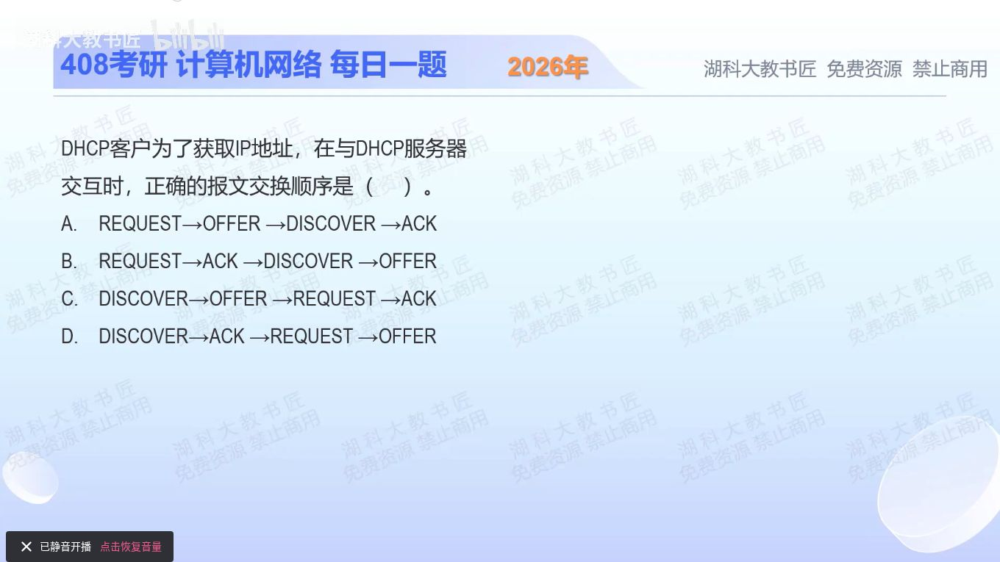

[目录](README.md)　·　[« 2025-0908](0908.md)　·　[2025-0910 »](0910.md)

# 2025-09-09

[原视频](https://www.bilibili.com/video/BV1hma2zUEDZ/)

<!-- review-lesson -->

## 先合上解析

不用四个英文词的首字母背口诀，按“谁有什么信息”恢复初次获取的四步。客户端收到OFFER为何还要REQUEST？

展开解析与逐项判断

先从尚无地址的客户端开始：它不知道找谁，先DISCOVER；服务器给出OFFER后，客户端才有可申请的方案；客户端再发REQUEST表明选择，服务器以ACK确认。按主体写出来就是 `C→S：发现；S→C：提供；C→S：请求；S→C：确认`。

因此选 **C：DISCOVER→OFFER→REQUEST→ACK**。A、B在本题初次完整获取流程中把REQUEST放到了发现之前；D在服务器尚未给出方案、客户端尚未请求时就提前ACK。

这条顺序限定初次完整获取。已经有租约的续租流程不必每次重新走四步，不能把本题顺序推广到所有DHCP报文交换。

只核对复盘检查

发现→提供→请求→确认。客户端可能收到多个方案，需要明确选择；服务器再确认租约配置。

## 换一个条件

已有租约的客户端到了续租时刻，是否一定先发DISCOVER？

完成后核对

不一定；续租通常直接向原服务器发DHCPREQUEST。本题四步针对初次完整获取，不是每次交互的强制前缀。

关联：[先辨发送者](0907.md)；[跨子网中继](../2026/0921.md)。

取证边界：[RFC 2131 §4.4.5](https://www.rfc-editor.org/rfc/rfc2131.html#section-4.4.5)用于区分初次获取与续租。

[复习入口](../../review/README.md) · 解析已补全，个人是否掌握以独立作答为准。
