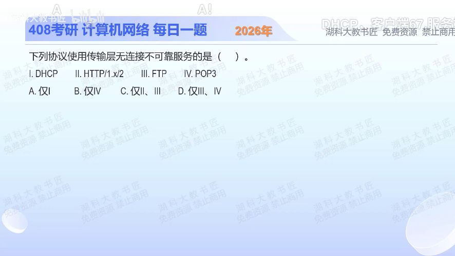

[目录](README.md)　·　[« 2025-0909](0909.md)　·　[2025-0911 »](0911.md)

# 2025-09-10

[原视频](https://www.bilibili.com/video/BV1fXamzPEfS/)

<!-- review-lesson -->

## 先合上解析

不看选项字母：把DHCP、HTTP/1.x/2、FTP、POP3各自接到UDP或TCP，说明“不可靠”是哪一层不承诺什么。

展开解析与逐项判断

先把题干的两条性质定位到传输层：本题“无连接、不可靠”指UDP服务；“不可靠”表示传输层不保证交付，不表示应用永远不能做重试。

Ⅰ DHCP使用UDP，符合。Ⅱ明确限定HTTP/1.x与HTTP/2，通常建立在TCP上，不符合。Ⅲ FTP的控制连接和数据连接均使用TCP；Ⅳ POP3也使用TCP，二者都不符合。因此选 **A（仅Ⅰ）**。B选了POP3；C、D所列均属于这里的TCP应用。

不能把“网页很快”当作无连接的依据；判断必须落在题目给定的协议版本。HTTP/3采用QUIC/UDP，但不能用它推翻题中明确的HTTP/1.x、2。

只核对复盘检查

DHCP→UDP；其余→TCP。UDP不提供可靠交付保证；应用仍可以自己处理超时和重试。

## 换一个条件

如果将Ⅱ改成HTTP/3，能否直接说“HTTP/3向应用提供不可靠传输”？

完成后核对

不能。HTTP/3经QUIC运行于UDP之上，但QUIC提供可靠的流传输。底层使用UDP与应用得到不可靠服务不能混为一谈。

关联：[网络服务分层](../2026/0907.md)；[HTTP耗时](1121.md)。

取证边界：HTTP/3边界见[ RFC 9114 §2](https://www.rfc-editor.org/rfc/rfc9114.html#section-2)。

[复习入口](../../review/README.md) · 解析已补全，个人是否掌握以独立作答为准。
