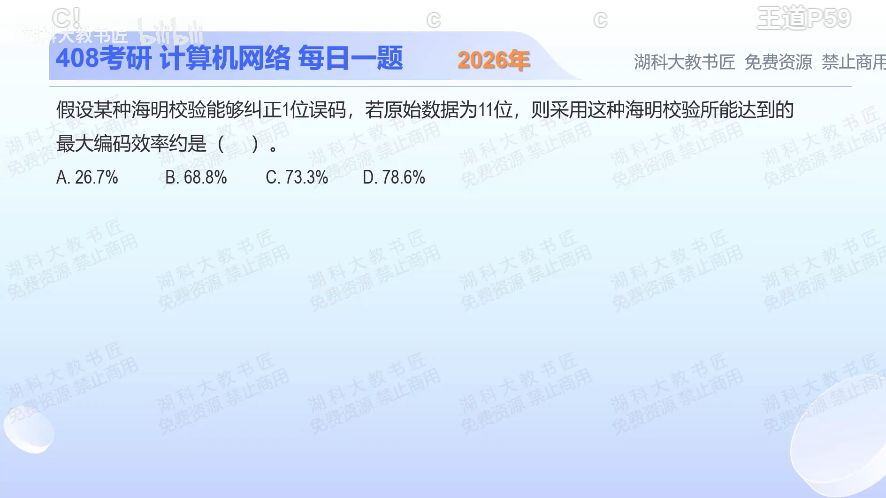

[目录](README.md)　·　[« 2025-0910](0910.md)　·　[2025-0912 »](0912.md)

# 2025-09-11

[原视频](https://www.bilibili.com/video/BV1NramzkEwC/)

<!-- review-lesson -->

## 先合上解析

从“需要区分哪些情况”写出不等式，求11位数据的最少校验位和编码效率。式子末尾的+1表示什么？

展开解析与逐项判断

原始数据11位，校验位设为r位，传出去共11+r位。只纠正一位错误时，需要分别识别“11+r个位置中哪一个错”和“没有错”，总计11+r+1种情况。r个校验结果只有2^r种组合，因此必须满足 `2^r ≥ 11+r+1`。

试r=3：8小于15，不够；试r=4：16等于16，刚好够。最大效率要选最少冗余，因此总长15位，有效数据比例 `11/15≈73.3%`，选 **C**。

A约26.7%是4/15，算成了校验位占比；B约68.8%是11/16，多加了一位；D约78.6%是11/14，对应3校验位，定位状态不够。不要把2^r当作实际总码长。

只核对复盘检查

2^r≥11+r+1，r=4，效率11/15；+1是无错误状态，不是一位额外的校验位。

## 换一个条件

若在该15位码基础上额外加一位总奇偶校验，用于扩展成常见SECDED码，效率变成多少？

完成后核对

11/16≈68.8%。新增总奇偶位带来双错检测能力，不能在原题只要求普通单错纠正时无条件加上。

关联：[校验结果定位](0913.md)；[换数据长度再算](../2026/0909.md)。

[复习入口](../../review/README.md) · 解析已补全，个人是否掌握以独立作答为准。
