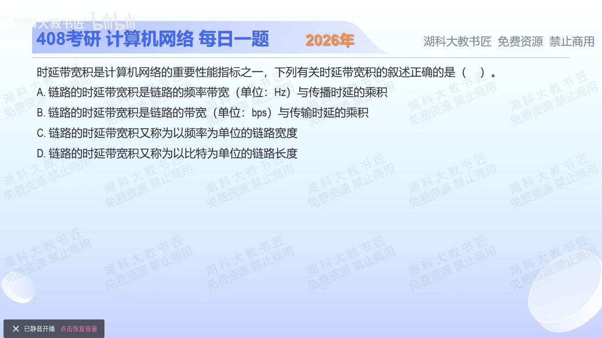

[目录](README.md)　·　[« 2025-0911](0911.md)　·　[2025-0913 »](0913.md)

# 2025-09-12

[原视频](https://www.bilibili.com/video/BV1iraxzAErc/)

<!-- review-lesson -->

## 先合上解析

为什么R×传播时延的单位是bit？若用R×发送时延，算出的又是什么？

展开解析与逐项判断

先看“时延”和“带宽”各指谁。本题的链路时延带宽积为 `R×τ`：R是每秒送入链路的比特数，τ是一个比特从一端传播到另一端的时间。第一个比特刚到对端时，发送端已经陆续送入Rτ个比特，因此它描述持续发送时链路中能容纳的在途比特数。

A把R错换成Hz；Hz描述频率范围，不能直接当bit/s。B用发送时延L/R去乘R只会得到这一帧的长度L，未描述链路传播容量。C说成以频率计的宽度，量纲不对。D“以比特为单位的链路长度”符合，因此选 **D**。

例如R=10 Mbit/s、τ=2 ms，积是20000 bit，不是20000 B。这里用单程传播时间；谈端到端未确认数据量时常用R×RTT，那是另一个具体问题。

只核对复盘检查

(bit/s)×s=bit，指在途容量；R×(L/R)=L，只是报文/帧的比特长度。

## 换一个条件

距离和介质不变，只把速率加倍：传播时延、单个比特占据的空间长度、时延带宽积分别如何变化？

完成后核对

传播时延不变；比特持续时间1/R减半，空间长度v/R减半；同一链路可容纳的比特数加倍。

关联：[两种时延的数值判断](1002.md)；[连续发送的吞吐](../2026/0908.md)。

[复习入口](../../review/README.md) · 解析已补全，个人是否掌握以独立作答为准。
