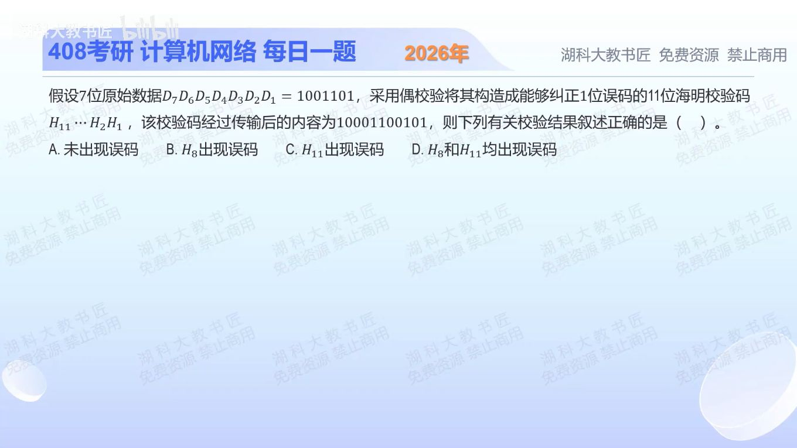

[目录](README.md)　·　[« 2025-0912](0912.md)　·　[2025-0914 »](0914.md)

# 2025-09-13

[原视频](https://www.bilibili.com/video/BV1hgaxzWEpN/)

<!-- review-lesson -->

## 先合上解析

从右向左编号，写出四个偶校验组，特别检查H₁₁属于哪些组。综合结果指向哪个位置？

展开解析与逐项判断

先确定编号方向：题目写H₁₁…H₁，所以最右边才是H₁。接收串10001100101从右向左编号，值为1的位置为1、3、6、7、11。

海明偶校验按位置编号的二进制位分组。s₁检查1、3、5、7、9、11，有4个1，得0；s₂检查2、3、6、7、10、11，也有4个1，得0；s₄检查4、5、6、7，有2个1，得0；s₈检查8、9、10、11，有1个1，得1。特别注意11的二进制是1011，它也属于s₂组，不能漏掉。

按s₈s₄s₂s₁排列为`1000₂=8`，单错出现在H₈，选 **B**。翻转H₈后码字为10011100101；从非校验位置11、10、9、7、6、5、3读出1001101，恰好回到原数据。A与非零综合结果矛盾；C、D错把H₁₁也判成错误。

也可将所有为1的位置编号异或：1⊕3⊕6⊕7⊕11=8。但必须先会分组，异或只是同一组奇偶判断的快捷实现，不能凭某一校验组失败就认定该组校验位错误。

只核对复盘检查

H₁₁=1011₂，属于s₁、s₂、s₈组；四组结果按s₈s₄s₂s₁读为1000，H₈单错。

## 换一个条件

若正确码字仅把H₁₁翻转，综合结果是多少？两位同时翻转还能直接按普通海明码纠正吗？

完成后核对

H₁₁单错得1011，三个校验组失败仍然只是一位错误。两位错的综合值是两位置编号异或，可能伪装成第三个位置，不能保证单错纠正法有效。

关联：[为何要足够多校验状态](0911.md)；[纠错与检错边界](1108.md)。

[复习入口](../../review/README.md) · 解析已补全，个人是否掌握以独立作答为准。
