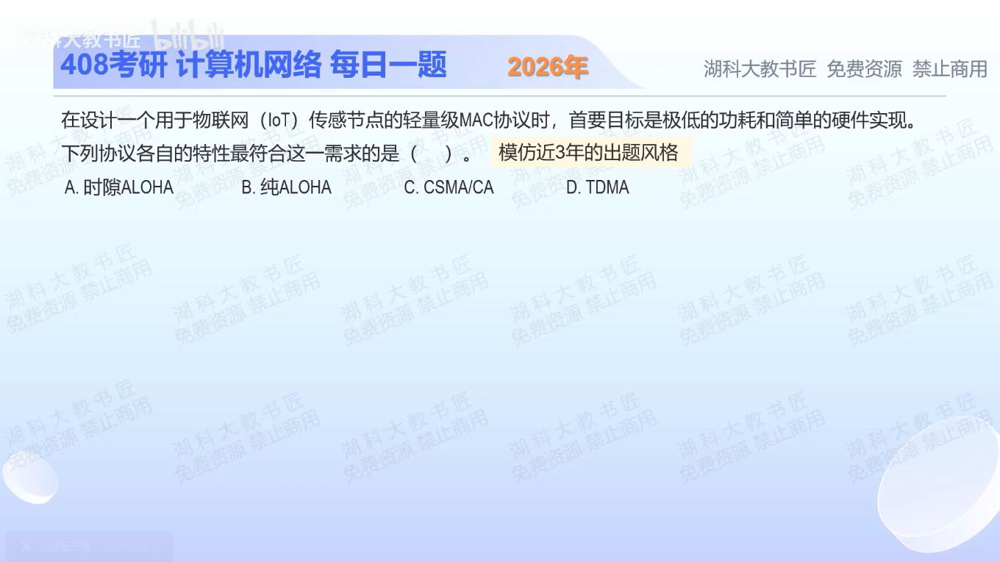

[目录](README.md)　·　[« 2025-0913](0913.md)　·　[2025-0915 »](0915.md)

# 2025-09-14

[原视频](https://www.bilibili.com/video/BV1yraszVEzE/)

<!-- review-lesson -->

## 先合上解析

按“是否需要时隙同步、是否要先侦听”区分四种方案。选择最简单方案时牺牲的是什么？

展开解析与逐项判断

先圈出优先级：题目首先追求“极低功耗、简单硬件”，没有首先要求高吞吐或严格时延。纯ALOHA不要求全网对齐时隙，也不必先持续侦听载波；有数据即可尝试发送，冲突后再退避重传。因此按本题的简化比较，选 **B（纯ALOHA）**。

A时隙ALOHA减少碰撞的时间范围，但多了时隙同步要求；C CSMA/CA需要载波侦听、退避等机制；D TDMA要安排并维持时隙，同步和调度更复杂。它们在其他指标下可能更合适，不能说纯ALOHA在一切物联网场景中都最好。

纯ALOHA付出的代价是冲突和重传。负载一高，重传本身也会耗电；本题缺少流量模型，只能在强调低实现复杂度的口径下判断，不能把它当工程选型的完整证明。

只核对复盘检查

纯ALOHA无需时隙同步和先侦听，实现简单；代价是碰撞概率与低负载以外的效率问题。其余方案分别增加同步、侦听或调度。

## 换一个条件

如果任务改成“同步条件已具备，多个节点周期性发送，要求避免竞争造成的不确定等待”，仍首选纯ALOHA吗？

完成后核对

不应沿用。此时可以考虑TDMA预分配时隙；先看目标和已具备条件，而不是把低功耗标签与某协议永久绑定。

关联：[随机、划分、轮流三类](0916.md)；[CSMA/CA的具体退避](0920.md)。

取证边界：异步ALOHA减少同步硬件这一边界可参看[低功耗随机接入研究](https://ieeexplore.ieee.org/document/10285046/)。

[复习入口](../../review/README.md) · 解析已补全，个人是否掌握以独立作答为准。
