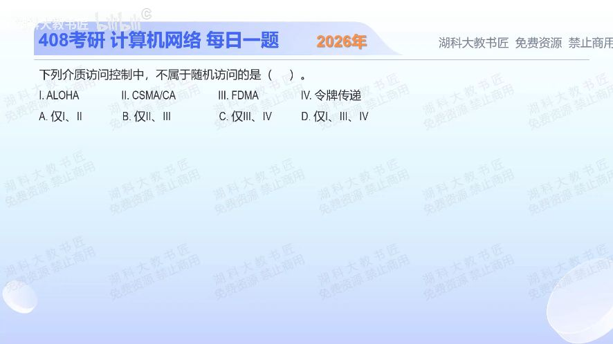

[目录](README.md)　·　[« 2025-0915](0915.md)　·　[2025-0917 »](0917.md)

# 2025-09-16

[原视频](https://www.bilibili.com/video/BV1ZkatzgEVG/)

<!-- review-lesson -->

## 先合上解析

给四种协议各写一种获得发送机会的方式，再圈出不靠竞争取得机会的两种。

展开解析与逐项判断

分类先看“发送机会如何得到”。ALOHA直接竞争发送，CSMA/CA先侦听并竞争空闲机会，二者都属于随机访问；协议有规则不等于它不随机。

FDMA把可用频带划成各自占用的子频带，属于信道划分。令牌传递由持令牌者获得发送权，属于轮流访问。因此不属于随机访问的是Ⅲ、Ⅳ，选 **C**。A恰好选了两种随机访问；B把ALOHA错收进来且漏令牌；D仍误收Ⅰ。

题目是否有“随机退避”是线索，但更稳的判断是资源预分配、争用机会还是持许可轮流发送。

只核对复盘检查

ALOHA与CSMA/CA竞争；FDMA预分频带；令牌靠持有发送许可，故Ⅲ、Ⅳ。

## 换一个条件

把FDMA换成TDMA、把令牌换成轮询，这两项还属于非随机访问吗？

完成后核对

仍是。TDMA按时隙划分，轮询由控制者依次授予机会；具体载体变了，资源分配方式未变。

关联：[按目标选择MAC](0914.md)；[CSMA/CA忙闲推进](0920.md)。

[复习入口](../../review/README.md) · 解析已补全，个人是否掌握以独立作答为准。
