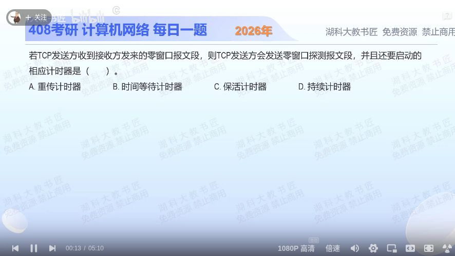

[目录](README.md)　·　[« 2025-0916](0916.md)　·　[2025-0918 »](0918.md)

# 2025-09-17

[原视频](https://www.bilibili.com/video/BV1GQatzPESm/)

<!-- review-lesson -->

## 先合上解析

接收端窗口恢复通知丢失后，双方各在等什么？哪种探测能解除这种停顿？

展开解析与逐项判断

“收到零窗口”说明接收端暂时没有空间，发送端不能继续按普通数据窗口发送。问题在于：接收端稍后恢复并发送非零窗口通知，如果该通知丢失，双方可能一个等数据、一个等窗口而长期停住。

发送端用**持续计时器（persist timer）**安排零窗口探测，让接收端有机会再次报告当前窗口，选 **D**。A重传计时器针对已发未确认数据的超时；B时间等待计时器服务连接关闭后的TIME-WAIT；C保活计时器用于长时间空闲连接的存活探测。这里的触发条件是接收窗口为零，不是ACK丢失或关闭连接。

探测是检查窗口是否重开的特殊机制，不等于发送方无视零窗口持续发送正常大批数据。

只核对复盘检查

发送端等窗口变大，接收端可能等数据；持续计时器触发零窗口探测，促使对方重新报告窗口。

## 换一个条件

接收窗口一直非零，但一个已经发出的数据段迟迟未收到确认，首先相关的是哪种计时器？

完成后核对

重传计时器。根据“等待的是确认还是窗口更新”辨认，不能看见等待超时就一律选持续计时器。

关联：[窗口限制与传输时间](1110.md)；[超时重传与RTT估计](1119.md)。

取证边界：[RFC 9293 §3.8.6.1](https://www.rfc-editor.org/rfc/rfc9293.html#section-3.8.6.1)。

[复习入口](../../review/README.md) · 解析已补全，个人是否掌握以独立作答为准。
