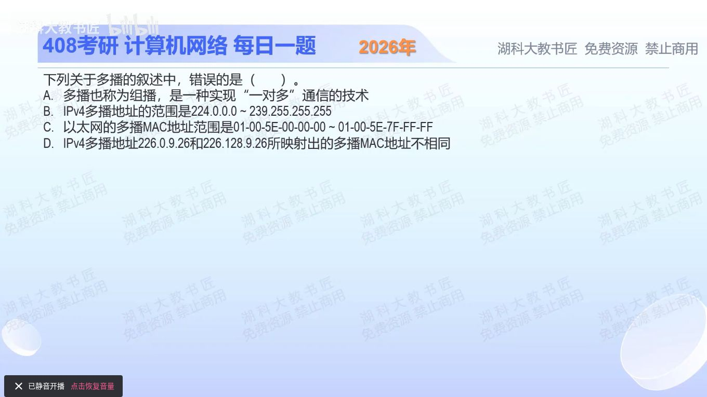

[目录](README.md)　·　[« 2025-0917](0917.md)　·　[2025-0919 »](0919.md)

# 2025-09-18

[原视频](https://www.bilibili.com/video/BV1hVatzFEgH/)

<!-- review-lesson -->

## 先合上解析

不要整串转二进制：226.0.9.26与226.128.9.26究竟差在哪一位？这一位是否被保留进MAC？

展开解析与逐项判断

本题问错误项。A说组播面向一组接收者，属于一对多通信，成立。B的224.0.0.0—239.255.255.255即224/4，是IPv4组播地址范围，成立。

IPv4组播映射到以太网时，前缀固定为01-00-5E，再取IP地址的低23位。C给出的01-00-5E-00-00-00—01-00-5E-7F-FF-FF正是这个映射范围。严格说它是**IPv4组播映射使用的**MAC范围，不是所有以太网组播MAC的全集。

比较D两地址：226.0.9.26与226.128.9.26只在第二字节最高位不同，而低23位只保留第二字节低7位和后两字节。因此两者都映射成 **01-00-5E-00-09-1A**，D声称不同，故选 **D**。IP组播可变28位，MAC只容纳23位，所以32个IPv4组播地址可能映到同一个MAC。

只核对复盘检查

差在第二字节最高位；该位不在低23位中，两个映射相同。最后一字节十进制26对应十六进制1A。

## 换一个条件

把第二个IP改成226.129.9.26，映射还相同吗？

完成后核对

不同。129的低7位是1，对应01-00-5E-01-09-1A；先丢高位，再比较保留位。

关联：[单播MAC判别](1013.md)；[地址位数与空间](1014.md)。

取证边界：[RFC 1112 §6.4](https://www.rfc-editor.org/rfc/rfc1112.html#section-6.4)。

[复习入口](../../review/README.md) · 解析已补全，个人是否掌握以独立作答为准。
