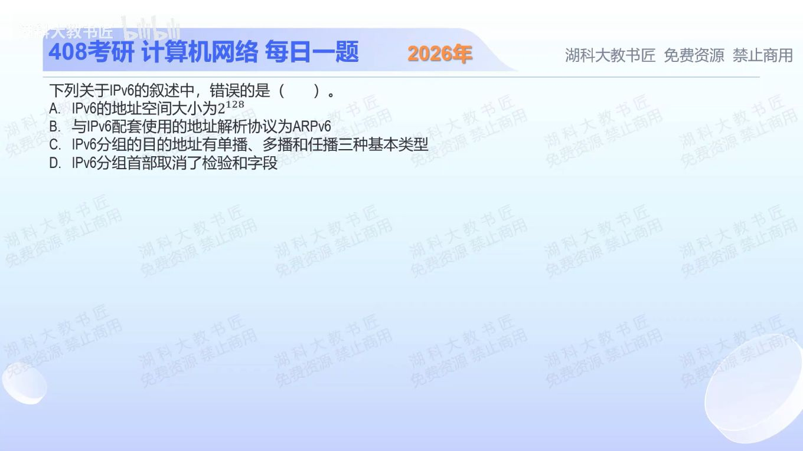

[目录](README.md)　·　[« 2025-0918](0918.md)　·　[2025-0920 »](0920.md)

# 2025-09-19

[原视频](https://www.bilibili.com/video/BV1CUa4zjEae/)

<!-- review-lesson -->

## 先合上解析

说出IPv6替代ARP的机制、基本首部是否有检验和、为何没有广播仍可向一组主机发送。

展开解析与逐项判断

先把IPv4经验逐项审查，别给每个旧协议简单加一个“v6”。A：IPv6地址128位，理论地址空间2^128，成立；这不是说每一种位组合都可作普通主机地址。

B错误：IPv6使用邻居发现NDP，在ICMPv6基础上完成邻居解析等工作，不是一个叫ARPv6的ARP版本。C列出单播、组播、任播三类目的地址，成立，IPv6没有广播地址。D也成立：IPv6基本首部取消了IPv4式首部检验和。

故选 **B**。取消首部检验和不等于所有层都不检错，链路层和上层仍有自己的检测机制；没有广播也不等于不能一对多，组播承担这类功能。

只核对复盘检查

NDP/ICMPv6；基本首部无检验和；用组播向指定组发送。三个判断属于不同对象，不混成“IPv6取消检错”。

## 换一个条件

如果选项改成“IPv6无需做本地链路的地址解析”，正确吗？

完成后核对

不正确。需要解析的任务仍在，只是由邻居发现承担，不能把协议名变化理解为功能消失。

关联：[IPv6首部长度](1003.md)；[IPv6文本压缩](1115.md)。

取证边界：[RFC 4861](https://www.rfc-editor.org/rfc/rfc4861.html)；[RFC 8200 §3](https://www.rfc-editor.org/rfc/rfc8200.html#section-3)。

[复习入口](../../review/README.md) · 解析已补全，个人是否掌握以独立作答为准。
