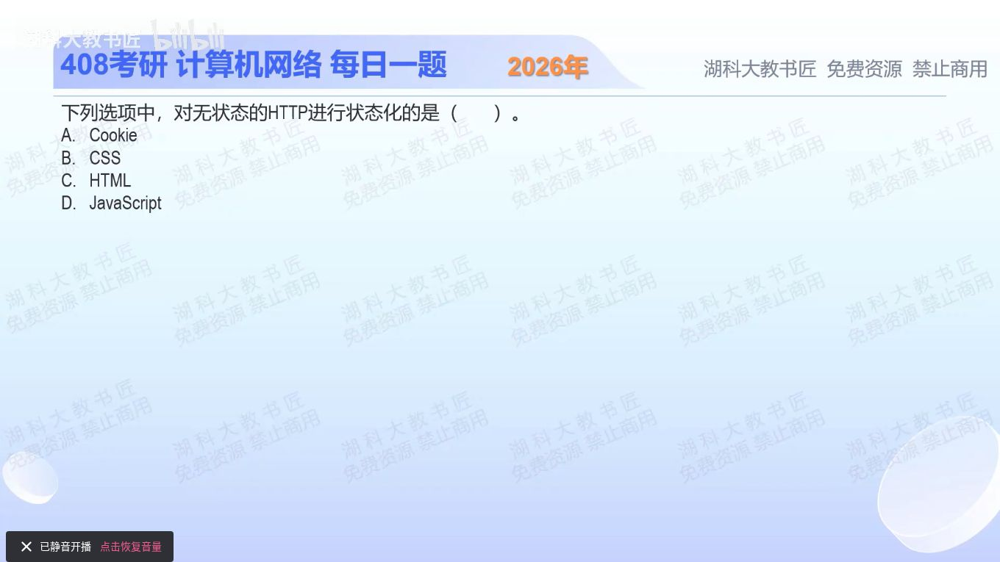

[目录](README.md)　·　[« 2025-0920](0920.md)　·　[2025-0922 »](0922.md)

# 2025-09-21

[原视频](https://www.bilibili.com/video/BV1TKY5zHEjz/)

<!-- review-lesson -->

## 先合上解析

两次HTTP请求如何被关联到同一会话？分别说出Set-Cookie、浏览器保存和Cookie请求首部是谁做的。

展开解析与逐项判断

HTTP无状态表示请求之间不天然保留应用会话关联。要让服务器把这次请求认成同一用户的后续操作，需要请求携带可关联的信息。Cookie正是服务器通过Set-Cookie下发、浏览器保存并按匹配规则在后续请求中带回的机制，选 **A**。

B CSS描述样式，C HTML描述页面结构，二者不承担会话标识机制。D JavaScript是编程语言，可以参与读写某些Cookie或实现其他状态处理，但不是本题对应的HTTP状态管理机制。

Cookie不必装下全部购物车或个人资料；它常只保存会话标识，具体状态保存在服务器。使用Cookie是在HTTP之上建立会话关联，没有把HTTP协议自身改造成必须记忆所有前次请求的协议。

只核对复盘检查

服务器发Set-Cookie，浏览器保存符合规则的Cookie并在后续匹配请求中带回；服务器据标识找会话。

## 换一个条件

浏览器与服务器重新建立了TCP连接，只要有效Cookie仍被带回，会话一定丢失吗？

完成后核对

不一定。应用会话标识与TCP连接不是同一个对象，Cookie可以跨连接关联请求。

关联：[进一步检查Cookie说法](1107.md)；[TCP连接数与HTTP请求](1121.md)。

[复习入口](../../review/README.md) · 解析已补全，个人是否掌握以独立作答为准。
