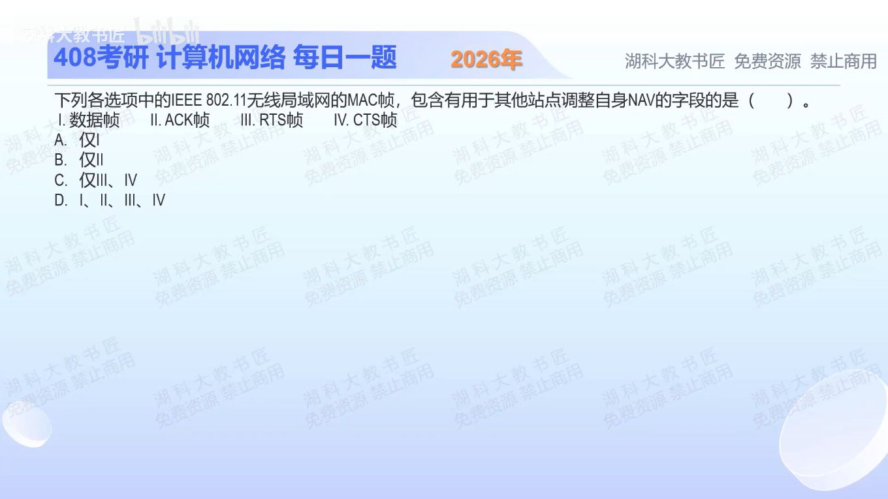

[目录](README.md)　·　[« 2025-0921](0921.md)　·　[2025-0923 »](0923.md)

# 2025-09-22

[原视频](https://www.bilibili.com/video/BV1goYVztEdD/)

<!-- review-lesson -->

## 先合上解析

终止交换的ACK里Duration为0，能否据此说ACK没有Duration字段？本题问存在性还是一定更新？

展开解析与逐项判断

NAV是站点对“信道还被预约多久”的本地记录，属于虚拟载波侦听。判断本题要看MAC帧有没有可携带持续时间的Duration/ID字段，不是只看RTS、CTS是否最常用于预约。

数据帧、ACK、RTS、CTS都具有相关字段，故Ⅰ—Ⅳ全包含，选 **D**。A、B都只保留一类；C只看到了RTS/CTS而漏掉数据帧和ACK。终止一次普通交换的ACK其Duration往往为0，但“取值为0”不等于“没有这个字段”。

NAV更新还有接收条件和规则，不是每收到一个0就立刻清除尚有效的更长预约。复盘时把字段存在、字段取值、是否实际延长NAV分成三问。

只核对复盘检查

不能。四类帧均有字段；题目问包含字段，不是每一个帧都必然把NAV延长。

## 换一个条件

若某站已有更长的有效NAV，听到一个Duration=0的ACK，能否简单立即抢发？

完成后核对

不能据此直接抢发。必须遵守NAV更新及物理侦听等规则；0不是无条件清除其他预约的命令。

关联：[退避何时执行](0920.md)；[RTS/CTS保护的区域](1111.md)。

[复习入口](../../review/README.md) · 解析已补全，个人是否掌握以独立作答为准。
