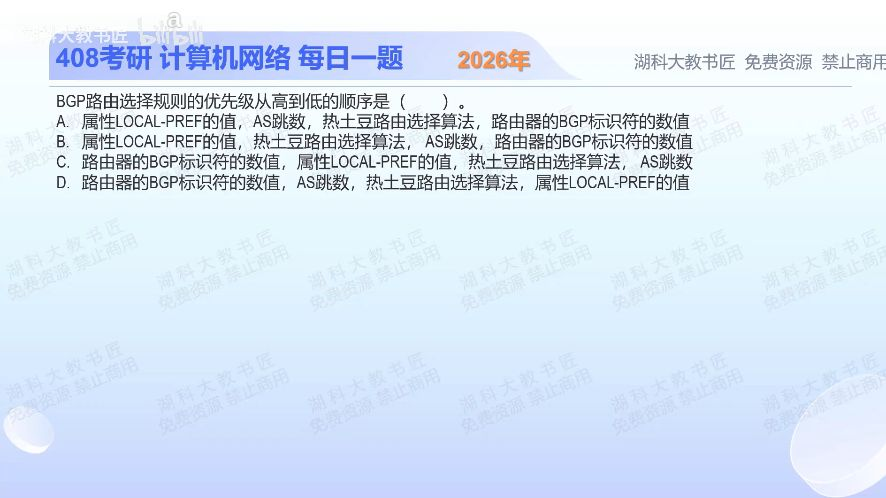

[目录](README.md)　·　[« 2025-0922](0922.md)　·　[2025-0924 »](0924.md)

# 2025-09-23

[原视频](https://www.bilibili.com/video/BV17Up6zHE4i/)

<!-- review-lesson -->

## 先合上解析

若一路LOCAL-PREF高但AS路径长，另一路LOCAL-PREF低但AS路径短，先比较哪一个？热土豆到底在缩短哪段路？

展开解析与逐项判断

先分清AS外部策略与本AS内部的出口成本。LOCAL-PREF表达本AS更偏好哪条外部路线，数值较大者优先；策略相同才比较AS_PATH长度，通常较短者优先。再有并列，才在题给的这几项中比较到出口的内部代价，即热土豆策略；仍并列才用较小BGP标识符等进行确定性选择。

因此这四项的相对顺序为 **LOCAL-PREF→AS跳数→热土豆→BGP标识符，选A**。B把内部出口成本提到AS路径之前；C、D把用于后段破平局的标识符放在策略之前。

这不是声称实际BGP只比较四项；本地发起、ORIGIN、MED等也可能参与具体实现的决策。本题考给定四项之间的先后，不要误背成完整产品配置规则。

只核对复盘检查

先LOCAL-PREF；热土豆优先较低内部代价的出口，缩短在本AS内部携带流量的路径，不是全网端到端最短路。

## 换一个条件

两路线LOCAL-PREF相同，路径分别为2个和3个AS，但3跳路线的出口就在身边；按本题四项先选谁？

完成后核对

先选AS_PATH较短的2跳路线。不能用内部近就覆盖更靠前的AS路径比较。

关联：[BGP向哪些邻居通告](1109.md)；[OSPF内部最短路](1113.md)。

取证边界：[RFC 4271 §9.1](https://www.rfc-editor.org/rfc/rfc4271.html#section-9.1)；题中只比较四项，不冒充完整实现优先级表。

[复习入口](../../review/README.md) · 解析已补全，个人是否掌握以独立作答为准。
