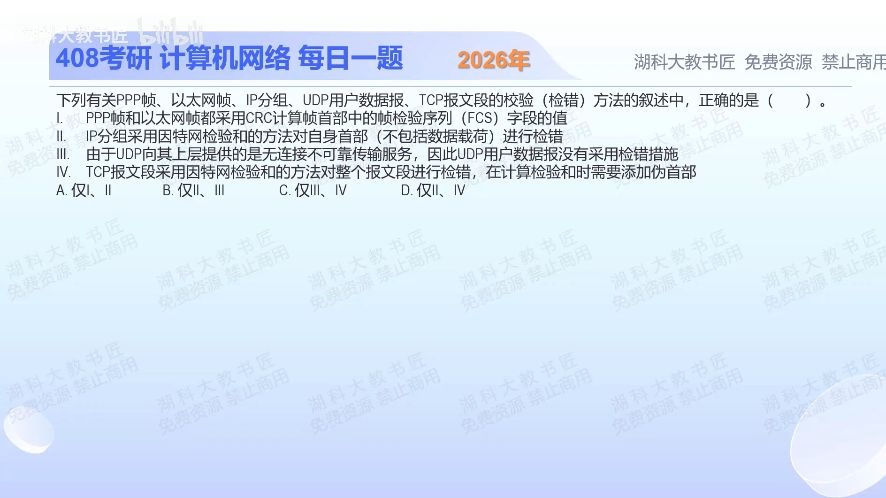

[目录](README.md)　·　[« 2025-0923](0923.md)　·　[2025-0925 »](0925.md)

# 2025-09-24

[原视频](https://www.bilibili.com/video/BV1ZapCzfE9m/)

<!-- review-lesson -->

## 先合上解析

分别回答：FCS在哪；IPv4检验和盖住哪部分；UDP不可靠是否等于不检错；TCP伪首部是否实际单独发送。

展开解析与逐项判断

逐项先圈“检验谁”和“字段在哪”，因为协议名字对也可能位置错。Ⅰ前半句PPP和以太网使用CRC没问题，但FCS在帧尾，不在题目所说帧首部，故Ⅰ错。

Ⅱ按此题有首部检验和的IP即IPv4理解：反码检验和覆盖自身首部，不覆盖IP数据载荷，成立。Ⅲ把不可靠误读成没有检错，错误；UDP有检验和机制，即使IPv4下可选择不用，也不能说该协议没有检错。Ⅳ TCP检验和覆盖TCP首部、数据，并加入伪首部参与计算，成立。

所以选 **D（仅Ⅱ、Ⅳ）**。A、B包含错误的Ⅰ，C包含错误的Ⅲ。伪首部是计算时借用的源/目的IP、协议、长度等信息，不是额外插入线上TCP报文段的真实首部。IPv6基本首部无此检验和，不能把Ⅱ推广到IPv6。

只核对复盘检查

FCS帧尾；IPv4只检首部；UDP有检错；伪首部只参与计算，不额外发送。

## 换一个条件

路由器仅将IPv4的TTL减1，且没有NAT、分片或其他改动，需要重算TCP检验和吗？

完成后核对

不需要，TTL不在TCP伪首部中；IPv4首部检验和需更新。若源/目的IP被NAT改写，则涉及TCP伪首部，需要相应更新TCP校验。

关联：[UDP实际求和](1124.md)；[逐层字段读图](1116.md)。

[复习入口](../../review/README.md) · 解析已补全，个人是否掌握以独立作答为准。
