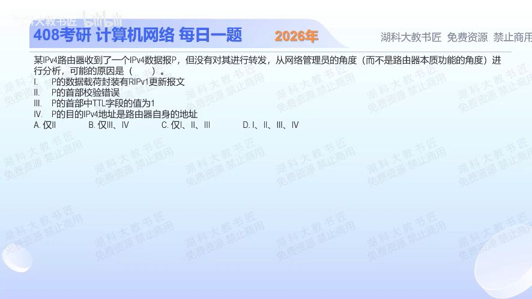

[目录](README.md)　·　[« 2025-0924](0924.md)　·　[2025-0926 »](0926.md)

# 2025-09-25

[原视频](https://www.bilibili.com/video/BV1ovpCzoE3m/)

<!-- review-lesson -->

## 先合上解析

“不转发”至少有哪些不同结局？将Ⅰ—Ⅳ分别放入本机处理、校验失败、TTL耗尽。

展开解析与逐项判断

截图实际问“收到IPv4数据报却没有转发的可能原因”，不是分片重组。先区分三种结局：本机处理、因错误丢弃、因转发生命期耗尽丢弃。没有转发不等于没有处理。

Ⅰ RIPv1更新用于邻居之间交换路由信息，通常通过本地广播交给邻居的RIP进程处理，不作为普通数据包原样穿越路由器继续转发，属于可能原因。Ⅱ IPv4首部校验错误，应丢弃。Ⅲ 需要转发的数据报若到达时TTL=1，减1后为0，应丢弃并按条件报告超时。Ⅳ目的IP是路由器自身地址，交付本机协议栈，也不再转发。

四种都可能，选 **D**。A漏掉本地处理和TTL；B漏Ⅰ、Ⅱ；C漏Ⅳ。题目特意说网络管理员角度，就是允许观察路由器控制进程收到的包，而不只盯硬件转发动作。

注意TTL=1不意味着发给路由器自身服务的包一律不能接收；它在这里解释的是本来需要继续转发的情形。

只核对复盘检查

Ⅰ、Ⅳ可本机处理；Ⅱ校验失败丢弃；Ⅲ转发时TTL耗尽。接收与转发是不同动作。

## 换一个条件

一个目的地址就是本机接口、TTL=1的合法包，能否仅凭TTL=1断言必须按转发超时丢弃？

完成后核对

不能。先判断本地交付还是继续转发；转发减TTL的规则不能直接替代本地接收规则。

关联：[traceroute利用TTL](0927.md)；[路由器直连接口](1016.md)。

[复习入口](../../review/README.md) · 解析已补全，个人是否掌握以独立作答为准。
