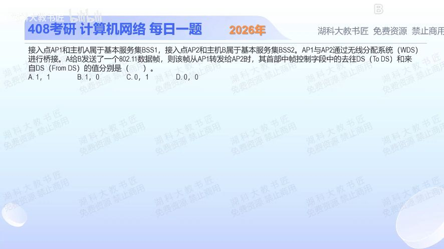

[目录](README.md)　·　[« 2025-0925](0925.md)　·　[2025-0927 »](0927.md)

# 2025-09-26

[原视频](https://www.bilibili.com/video/BV1c4pCzPEcY/)

<!-- review-lesson -->

## 先合上解析

在A→AP1→AP2→B中圈出题问的一跳，再写To DS、From DS。为何WDS常需四个地址？

展开解析与逐项判断

只画当前正在问的这一跳：A→AP1→AP2→B，而题目问**AP1转发给AP2**。两AP用无线分布系统WDS桥接，此跳既承接分布系统转发，又朝另一分布端转送，To DS=1、From DS=1，选 **A**。

B的(1,0)对应普通站点向AP上传；C的(0,1)对应AP向站点下发；D的(0,0)常见于不经过分布系统的直接通信等情况。不能因为整个业务是A发给B，就一直沿用第一跳A→AP1的标志位。

WDS帧通常要容纳四个地址：当前无线接收者AP2、无线发送者AP1，以及原始目的B、原始源A。前两个解决这一跳怎么交付，后两个保存端到端二层转发身份。

只核对复盘检查

AP1→AP2，(1,1)。要同时保留本跳收发者与原始源/目的，四种角色不能压成两种。

## 换一个条件

若把问题改成最后一跳AP2→B，两标志如何变化？

完成后核对

(0,1)。帧从分布系统出来交给普通站点；必须随当前一跳重新判断。

关联：[无线三地址真题](../../src/1002-answer.md#q04)；[四地址含义与转发](1104.md)。

[复习入口](../../review/README.md) · 解析已补全，个人是否掌握以独立作答为准。
