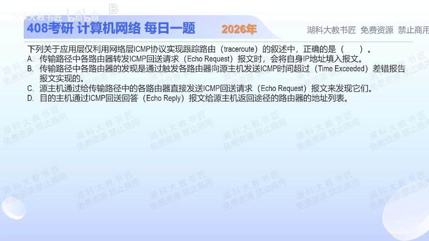

[目录](README.md)　·　[« 2025-0926](0926.md)　·　[2025-0928 »](0928.md)

# 2025-09-27

[原视频](https://www.bilibili.com/video/BV1kspCzvEAd/)

<!-- review-lesson -->

## 先合上解析

未知中间路由器地址时，如何让第k跳“自己报告”？探测包的目的地址到底填谁？

展开解析与逐项判断

本题限定用ICMP回送请求进行traceroute。源主机把探测包的目的仍设为最终目的主机，先让TTL=1；第一台需转发的路由器减到0，回送ICMP时间超过。再用TTL=2、3……，使后面的路由器依次暴露，源主机从这些返回报文的源地址识别各跳。

所以 **B正确**。A误以为路由器把自身IP写进原探测包，这更像混淆IP记录路由选项；C说直接给每台中间路由器发请求，但源主机起初根本不知道那些地址；D把最终主机的Echo Reply误认为返回完整路径列表。

到达目的主机时，ICMP探测通常收到Echo Reply，说明探测走到了终点。返回路径可能不同，某跳不回应也不必然表示那台路由器不能转发。

只核对复盘检查

目的仍填最终主机，用TTL=k控制在第k台转发路由器处耗尽，从其ICMP时间超过报文识别这一跳。

## 换一个条件

如果某一跳不返回ICMP，但更大TTL能收到后续路由器回复，能否判定该跳已经断网？

完成后核对

不能。它可能过滤或限速ICMP回复，仍可正常转发；区分数据转发能力与对探测的响应策略。

关联：[TTL=1为何不转发](0925.md)；[环路与超时](1024.md)。

[复习入口](../../review/README.md) · 解析已补全，个人是否掌握以独立作答为准。
