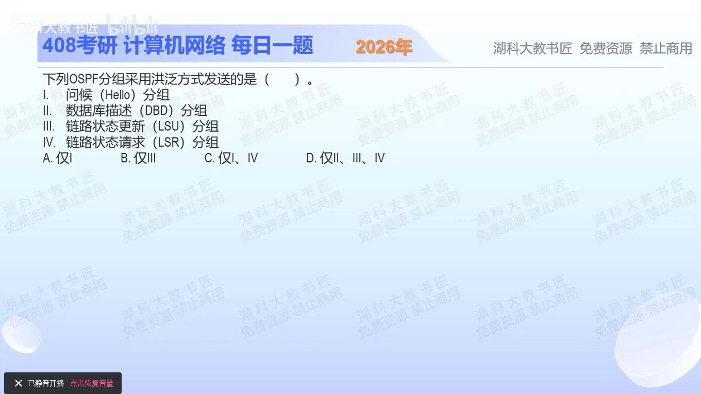

[目录](README.md)　·　[« 2025-0927](0927.md)　·　[2025-0929 »](0929.md)

# 2025-09-28

[原视频](https://www.bilibili.com/video/BV1ntpCzYEN4/)

<!-- review-lesson -->

## 先合上解析

依次给Hello、DBD、LSR、LSU各配一个动作：找邻居、对目录、要正文、送正文。哪一种承担LSA洪泛？

展开解析与逐项判断

“洪泛”不是简单“给多个人发”，而是路由器收到新的链路状态信息后，按规则继续向相关邻接传播，让区域内数据库趋于一致。承担LSA传送的报文是LSU，因此Ⅲ成立，选 **B（仅Ⅲ）**。

Ⅰ Hello用于发现和维持邻居，在本链路与邻居交互，不被当作全区域拓扑更新逐跳洪泛。Ⅱ DBD交换数据库摘要，帮助相邻路由器比较缺少什么。Ⅳ LSR请求具体缺少的LSA，也不是广播式扩散全区域的载体。A、C、D均把这些邻接交互误算作洪泛。

同一种LSU还可能用于回应某邻居的请求；它是承载LSA并实现洪泛的报文类型，不代表每一次LSU发送都必须原样向所有接口复制。

只核对复盘检查

Hello找邻居，DBD对摘要，LSR请求缺项，LSU送LSA正文；洪泛依靠LSU。

## 换一个条件

Hello使用组播目的地址，就能因此把它判为洪泛报文吗？

完成后核对

不能。链路内一对多投递与路由器继续传播拓扑信息不是同一件事。

关联：[Hello稳定期比例](1004.md)；[建立邻接的完整顺序](1113.md)。

取证边界：[RFC 2328 §A.3.5](https://www.rfc-editor.org/rfc/rfc2328.html#appendix-A.3.5)。

[复习入口](../../review/README.md) · 解析已补全，个人是否掌握以独立作答为准。
