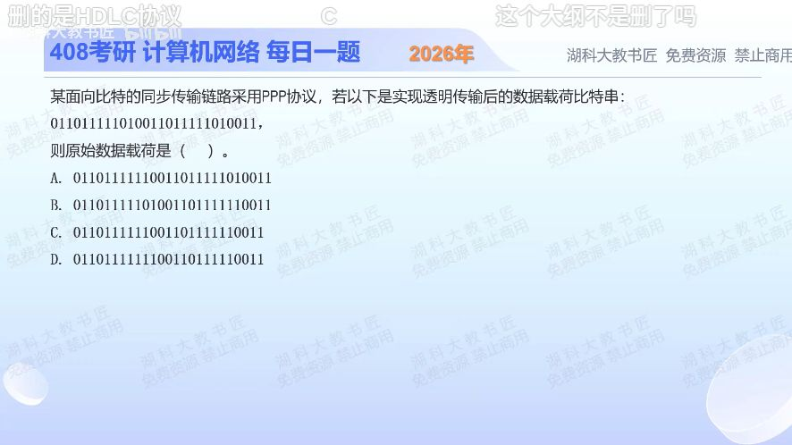

[目录](README.md)　·　[« 2025-0928](0928.md)　·　[2025-0930 »](0930.md)

# 2025-09-29

[原视频](https://www.bilibili.com/video/BV1M3pCz5E6c/)

<!-- review-lesson -->

## 先合上解析

标出接收串中两个应删除的0，只删这两位并拼回。删完以后原数据里能否出现连续六个1？

展开解析与逐项判断

题目给的是已经填充后的比特串，要做接收端去填充。规则是扫描连续1，遇到五个连续1就删除其后用于填充的0，然后重新开始计数；不能删除所有0，也不能拿7D字节转义规则处理同步比特流。

把接收串按两个填充点分开：`0110 11111 [0] 100110 11111 [0] 10011`。方括号两位是插入的0，去掉后拼回 `0110111111001101111110011`，与 **D** 一致。原来27位，去掉2位后25位，也可辅助核对长度。

A、B、C与这条逐位恢复结果不一致；不要用“哪串长得像”猜选项。检查时可反向再填充：恢复串每遇五个1插0，应精确得到题目给出的接收串。

只核对复盘检查

删除接收串第10、22位，得0110111111001101111110011。原始数据可以有六个1；限制连续1是传输编码的规则。

## 换一个条件

若原始数据恰好为111110，发送端插入后是111110还是1111100？接收端删哪个0？

完成后核对

发送11111[0]0，即1111100。先删紧跟五个1的填充0，保留原数据最后的0，恢复111110。

关联：[字节填充不可混用](0915.md)；[检错与透明传输不同](0924.md)。

[复习入口](../../review/README.md) · 解析已补全，个人是否掌握以独立作答为准。
