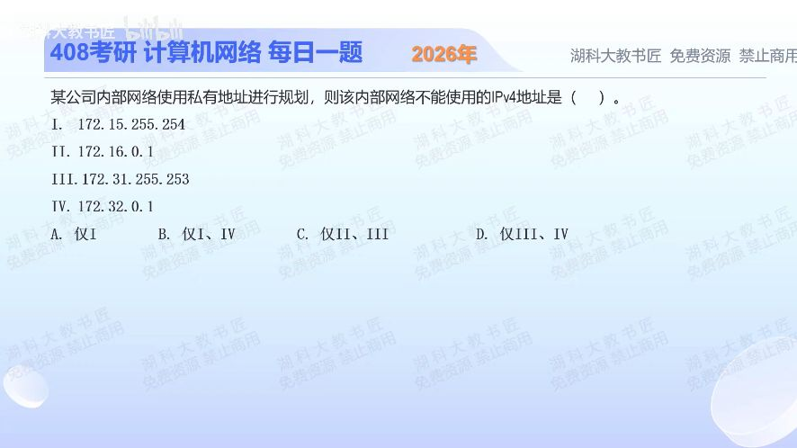

[目录](README.md)　·　[« 2025-0929](0929.md)　·　[2025-1001 »](1001.md)

# 2025-09-30

[原视频](https://www.bilibili.com/video/BV1sEpCzzEL6/)

<!-- review-lesson -->

## 先合上解析

不看选项，恢复172私有段的起止范围。172.31.255.253为何不能仅凭255判成广播？

展开解析与逐项判断

限定“使用私有地址规划”，先写出RFC1918的三段：10.0.0.0/8、172.16.0.0/12、192.168.0.0/16。第二段不是整个172开头，而是172.16.0.0到172.31.255.255。

于是Ⅰ 172.15.255.254低于起点；Ⅱ 172.16.0.1在范围内；Ⅲ 172.31.255.253在范围内；Ⅳ 172.32.0.1超过终点。不能用作本题私有地址的是Ⅰ、Ⅳ，选 **B**。A漏Ⅳ；C选了可用的两项；D误排Ⅲ。

“私有地址”判断与某个具体子网的网络地址/广播地址判断不同。本题没有给子网掩码，不要凭末尾出现255就把Ⅲ一概判成广播。

只核对复盘检查

172.16.0.0—172.31.255.255；广播要看具体掩码下主机位是否全1，某个字节是255不足以判断。

## 换一个条件

172.20.1.255/23是否是该子网的广播地址？若改为/22呢？

完成后核对

/23属于172.20.0.0—172.20.1.255，是广播；/22属于172.20.0.0—172.20.3.255，不是广播。私有性不变，主机位边界变了。

关联：[子网与可用主机数](1017.md)；[静态路由与直连](1020.md)。

[复习入口](../../review/README.md) · 解析已补全，个人是否掌握以独立作答为准。
