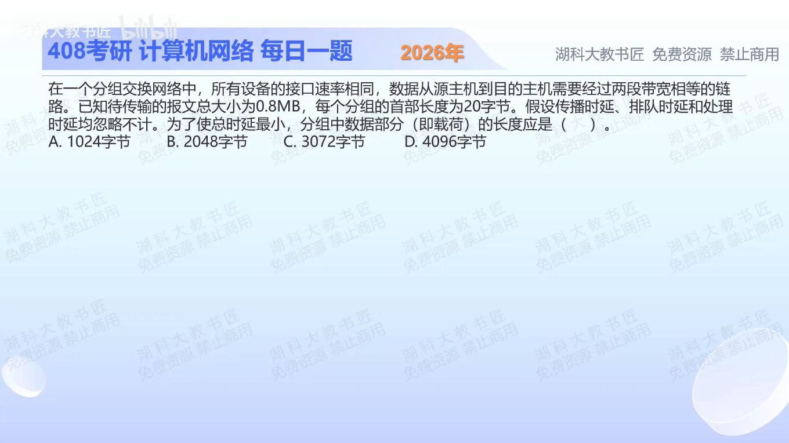

[目录](README.md)　·　[« 2025-0930](0930.md)　·　[2025-1002 »](1002.md)

# 2025-10-01

[原视频](https://www.bilibili.com/video/BV1B5nCzsE6c/)

<!-- review-lesson -->

## 先合上解析

不背根号公式：为什么总发送轮数是包数+1？把会随x变化的两项单独写出来。

展开解析与逐项判断

截图实际问“分组长度如何使两段链路上的总时延最小”。设原报文为M字节，每包数据x字节、首部h=20字节。两段等速链路采用存储转发：第一包走完两段需要两次发送时间；之后流水线每经过一次发送时间再交付一包。

暂按可整分模型，共M/x包，总时延与 `(M/x+1)(x+h)=M+h+Mh/x+x` 成正比。能调整的部分只有Mh/x+x：包太小，重复首部太多；包太大，最后一包在第二段的尾部等待太长。由两项相等或求导得 `x=√(Mh)`。

按本题选项所用二进制M口径，M=0.8×2²⁰，得√(0.8×2²⁰×20)=**4096B，选D**。若按十进制M则理论最优4000B，四个离散选项中仍是4096B最优。A、B、C都在最优值以下，首部重复代价更大。

此式含明确前提：两段、等速、存储转发、忽略题中所列其他时延；不能用来决定所有网络的固定包长。

只核对复盘检查

两段流水线需要先填充一段，n包最终用n+1个包发送时长；可变项是Mh/x与x，一项随包变小增大，一项随包变大增大。

## 换一个条件

链路改为三段等速存储转发，其余相同，可变项和最优x如何变？

完成后核对

总时延正比(M/x+2)(x+h)，可变项Mh/x+2x，最优x=√(Mh/2)。多出的转发段增加大包的尾部代价。

关联：[三段分组长度题](../2026/0918.md)；[发送与传播不能混加](1002.md)。

[复习入口](../../review/README.md) · 解析已补全，个人是否掌握以独立作答为准。
