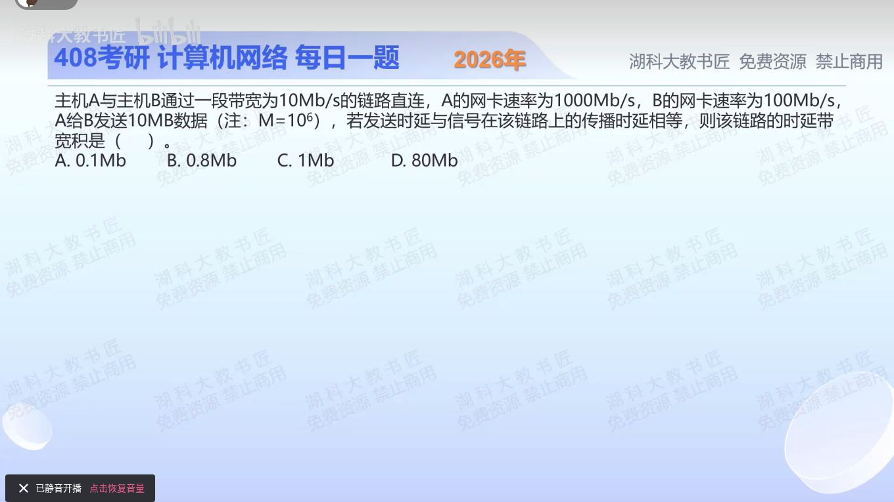

[目录](README.md)　·　[« 2025-1001](1001.md)　·　[2025-1003 »](1003.md)

# 2025-10-02

[原视频](https://www.bilibili.com/video/BV1E5nCzsEgN/)

<!-- review-lesson -->

## 先合上解析

为什么用10而不是100或1000Mb/s？“两个时延相等”如何把Rτ化成报文长度？

展开解析与逐项判断

先确定真正的发送速率。链路只有10Mb/s，A网卡1000Mb/s、B网卡100Mb/s都不能使该链路超过10Mb/s；按题给瓶颈速率R=10Mb/s计算。

10MB=80Mb，发送时延为80/10=8s。题设又给发送时延与传播时延相等，所以传播时延τ=8s。时延带宽积Rτ=10×8=**80Mb，选D**。A、B、C均不等于这一单位一致的计算结果，常见误区是把B当b或取网卡标称速率。

也可保底化简：既然τ=L/R，Rτ=L，所以答案直接等于该数据量的比特数；仍要做10MB→80Mb的换算。不是所有时延带宽积都等于报文大小，这次相等来自题设。

只核对复盘检查

链路是瓶颈；τ=L/R，因此Rτ=L=80Mb。MB到Mb需乘8。

## 换一个条件

保持链路和距离不变，改发20MB。传播时延会加倍吗？时延带宽积还等于这次报文长度吗？

完成后核对

传播时延仍8s，积仍80Mb；发送时延增至16s，两时延不再相等，不能继续把积当160Mb。

关联：[时延带宽积的含义](0912.md)；[连续发送到达时间](../2026/0908.md)。

[复习入口](../../review/README.md) · 解析已补全，个人是否掌握以独立作答为准。
