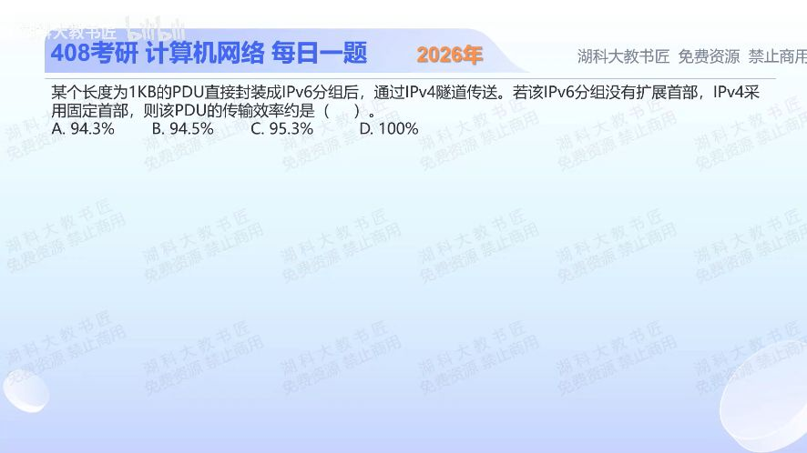

[目录](README.md)　·　[« 2025-1002](1002.md)　·　[2025-1004 »](1004.md)

# 2025-10-03

[原视频](https://www.bilibili.com/video/BV175nCzsE9R/)

<!-- review-lesson -->

## 先合上解析

画出线上由外到内三段：IPv4首部、IPv6首部、PDU，并各写长度。效率分子的有效数据是谁？

展开解析与逐项判断

先按封装层次写长度：原PDU为1024B；装入无扩展首部的IPv6分组，加40B基本首部；IPv4隧道把**整个IPv6分组**当作自己的载荷，再加最小20B IPv4首部。总长1024+40+20=1084B。

传输效率以原PDU为有效部分，故1024/1084≈**94.5%，选B**。A约94.3%对应把1KB按1000B理解；本题选项显示采用1KB=1024B的教材口径。C不对应两层首部共60B的开销；D漏掉了全部封装。

隧道并没有把IPv6首部替换成IPv4首部，而是在外面再套一层。题目未计链路层开销，不能擅自再加以太网帧首尾。

只核对复盘检查

20+40+1024；分子1024，不把原IPv6首部也算成该PDU有效内容。

## 换一个条件

若IPv6再带16B扩展首部，IPv4仍20B，效率变成什么表达式？

完成后核对

1024/(1024+40+16+20)=1024/1100≈93.1%。扩展首部在IPv6载荷长度中，但仍不是原PDU的有效字节。

关联：[OSPF以太网封装](1004.md)；[IPv4选项与填充](../2026/0922.md)。

取证边界：[RFC 8200 §3](https://www.rfc-editor.org/rfc/rfc8200.html#section-3)规定40B基本首部；1KB的数值口径按本题选项说明。

[复习入口](../../review/README.md) · 解析已补全，个人是否掌握以独立作答为准。
