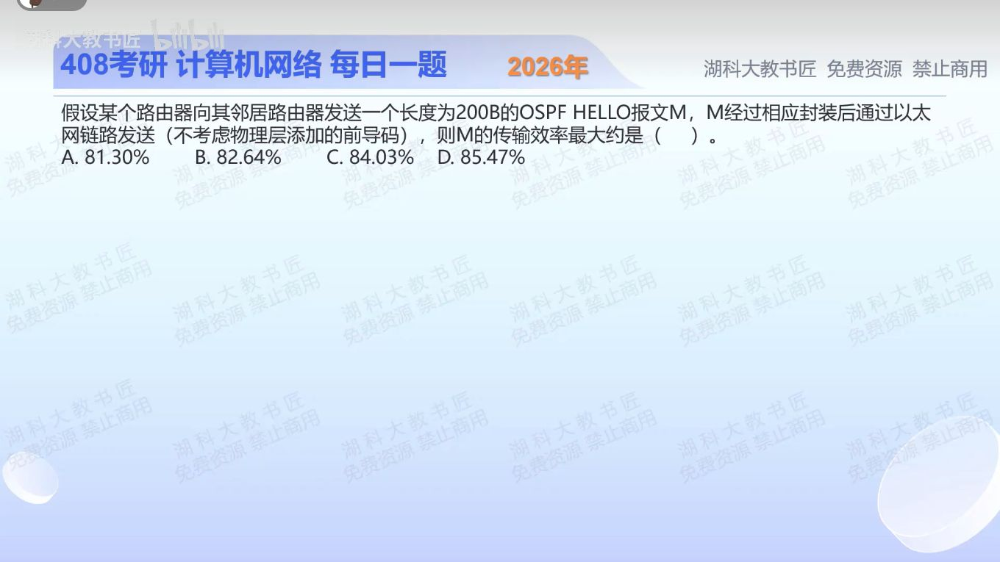

[目录](README.md)　·　[« 2025-1003](1003.md)　·　[2025-1005 »](1005.md)

# 2025-10-04

[原视频](https://www.bilibili.com/video/BV1E5nCzsE8L/)

<!-- review-lesson -->

## 先合上解析

OSPF后面直接接哪一层？把200B之外必需的20、14、4分别说清。为什么不用补齐46B？

展开解析与逐项判断

原报文M已经是200B的OSPF Hello报文，不再另加一次OSPF首部。OSPF直接承载于IP上，不经过TCP或UDP。要让效率最大，IPv4首部取最小20B；以太网MAC首部14B、FCS4B，题目排除物理层前导码。

所以总帧长200+20+14+4=238B，有效比例200/238≈**84.03%，选C**。A对应加8B后分母246，容易由误加UDP或前导字段得到；B对应分母242，多计4B；D对应分母234，漏FCS4B。

载荷220B已经超过以太网最小46B，不需要填充。“最大效率”是让可变首部/额外封装最小，并非允许删除必需的FCS。

只核对复盘检查

直接IP；20B IPv4首部、14B以太网首部、4B FCS；以太网载荷为220B，已够最小载荷。

## 换一个条件

如果把原200B报文换成应用层UDP报文，仍200B且其余条件不变，最大效率是多少？

完成后核对

还须加8B UDP首部，200/(200+8+20+18)=200/246≈81.30%。同样大小的“报文”要先确定属于哪一层。

关联：[协议层次辨认](0910.md)；[UDP有效比例](../2026/0916.md)。

[复习入口](../../review/README.md) · 解析已补全，个人是否掌握以独立作答为准。
