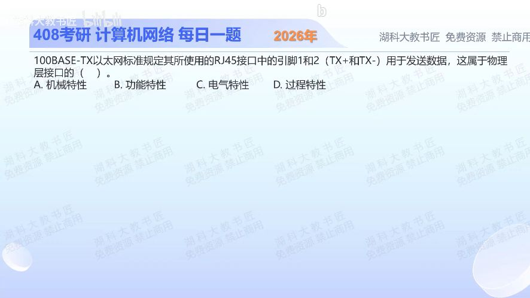

[目录](README.md)　·　[« 2025-1004](1004.md)　·　[2025-1006 »](1006.md)

# 2025-10-05

[原视频](https://www.bilibili.com/video/BV1zGnCzdESD/)

<!-- review-lesson -->

## 先合上解析

把“1、2脚发送数据”中的真正谓语找出来，解释为何不是机械特性。

展开解析与逐项判断

题干说引脚1、2“用于发送数据”，给的是引脚承担的用途，因此属于**功能特性，选B**。即使提到了RJ45和引脚，也不能仅凭出现硬件名就选机械。

A机械特性说明接头形状、尺寸、引脚数量和排列等；C电气特性说明电压、电流、阻抗和信号电平等；D过程特性说明接口操作的先后、时序和配合过程。这里只有“这两个脚做什么”，没有给形状、电压或先后动作。

做这类题先把句子缩成“外形是什么／电信号是什么／各部件做什么／操作怎样依次发生”，再匹配类别。

只核对复盘检查

谓语是用于发送，规定用途；引脚编号只是指对象，不是在规定数量、尺寸或布局。

## 换一个条件

若描述改成“该接口有8个触点，触点间距为某数值”，应选哪种？若改成“电平达到某伏特表示1”呢？

完成后核对

前者机械特性，后者电气特性。先看规定的属性，不看句子里是否出现引脚。

关联：[分层提供什么服务](../2026/0907.md)；[具体线路编码](1006.md)。

[复习入口](../../review/README.md) · 解析已补全，个人是否掌握以独立作答为准。
