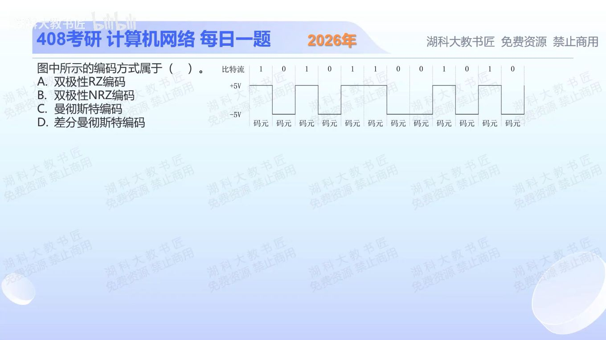

[目录](README.md)　·　[« 2025-1005](1005.md)　·　[2025-1007 »](1007.md)

# 2025-10-06

[原视频](https://www.bilibili.com/video/BV1EGnCzdEQT/)

<!-- review-lesson -->

## 先合上解析

遮住选项：检查的是位中点还是位边界？用连续11说明为何不属于曼彻斯特。

展开解析与逐项判断

图中1在整个码元内保持+5，0在整个码元内保持−5，两个极性都有，但中途不回到零电平。因此是双极性不归零编码，选 **B**。

A归零码必须在一个码元中回零；C曼彻斯特每位中点都要跳变，图中连续11、00却保持相同电平；D差分曼彻斯特同样要求每位中点跳变，信息放在位边界是否跳变。不能只因存在正负电平就断言是哪种曼彻斯特码。

只核对复盘检查

连续11保持高电平，没有每位必有的中点跳变；这是双极性NRZ。

## 换一个条件

若每个1先为+5再回0，每个0先为−5再回0，名称如何变化？

完成后核对

变成双极性归零码；正负两极没有变，改变的是每位后半段回零。

关联：[差分与普通曼彻斯特转换](1010.md)。

[复习入口](../../review/README.md) · 解析已补全，个人是否掌握以独立作答为准。
