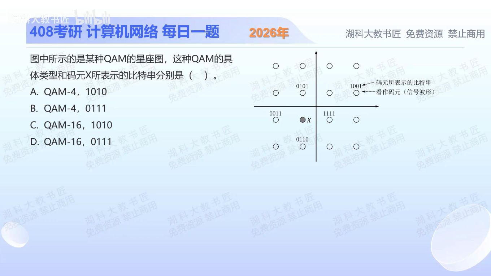

[目录](README.md)　·　[« 2025-1006](1006.md)　·　[2025-1008 »](1008.md)

# 2025-10-07

[原视频](https://www.bilibili.com/video/BV1JGnCzdEVg/)

<!-- review-lesson -->

## 先合上解析

分两步回答：为什么是16而不是4？0111与四个最近邻分别差哪一位？

展开解析与逐项判断

先数星座点：4行×4列=16种符号，故是16-QAM，每个符号携带log₂16=4位。A、B把每轴4种位置误当总符号数，排除。

再按题图采用的相邻点格雷标记检查X。X上方0101、左方0011、右方1111、下方0110；填0111时与四个邻点各只差一位，因此选 **D**。C的1010与这些邻点不满足该局部一位差关系。

QAM本身并不强制唯一比特命名；这里依据给出的标记和常用格雷排列恢复X，不是说任何16-QAM该位置都只能叫0111。

只核对复盘检查

总点数16；与0101差第3位、0011差第2位、1111差第1位、0110差第4位（从左数）。

## 换一个条件

若8种相位各有2种可区分幅度，共多少状态？每符号多少位？

完成后核对

共16种状态，4位/符号。数的是不同的幅度与相位组合，不单数相位。

关联：[奈奎斯特与香农联合使用](1009.md)。

[复习入口](../../review/README.md) · 解析已补全，个人是否掌握以独立作答为准。
