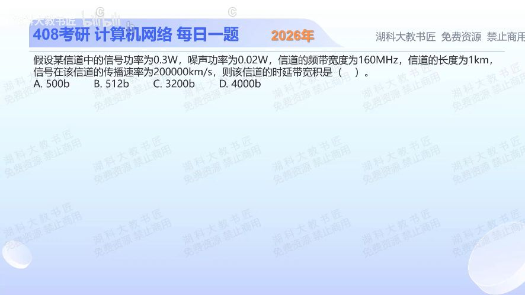

[目录](README.md)　·　[« 2025-1007](1007.md)　·　[2025-1009 »](1009.md)

# 2025-10-08

[原视频](https://www.bilibili.com/video/BV1JGnCzdEVW/)

<!-- review-lesson -->

## 先合上解析

先算15、再算4、最后算5μs：三个数分别代表什么？为什么最终单位是比特？

展开解析与逐项判断

先求线性信噪比S/N=0.3/0.02=15，再用香农上限C=Wlog₂(1+S/N)=160×10⁶×log₂16=640Mb/s。注意带宽160MHz不是直接等于160Mb/s。

传播时延τ=1km/(200000km/s)=5μs。按本题由信道参数求理论最大速率的口径，时延带宽积Cτ=640×10⁶×5×10⁻⁶=**3200比特，选C**。A、B、D均不等于这两个计算步骤的乘积。

实际运行若采用较低发送速率，实际在途比特数也会更小；香农容量是上限，不是承诺该信道必然运行在640Mb/s。

只核对复盘检查

15是功率比，4是log₂16，5μs是传播时延；bit/s乘s得到bit。

## 换一个条件

距离变成2km且带宽与信噪比不变，容量和理论时延带宽积各怎样变化？

完成后核对

容量仍640Mb/s，传播变10μs，积6400bit。距离在本题假设中影响传播时间，不直接改变给定信噪比下的容量。

关联：[时延带宽积](0912.md)；[噪声分贝换算](1009.md)。

[复习入口](../../review/README.md) · 解析已补全，个人是否掌握以独立作答为准。
