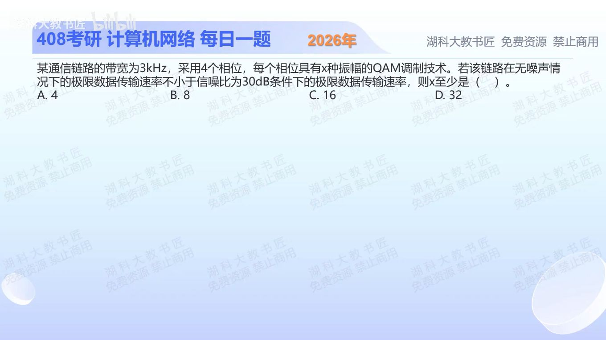

[目录](README.md)　·　[« 2025-1008](1008.md)　·　[2025-1010 »](1010.md)

# 2025-10-09

[原视频](https://www.bilibili.com/video/BV1kNnCzhEyr/)

<!-- review-lesson -->

## 先合上解析

不看公式直接写两个约束各依赖哪些量，然后解释为什么要把30dB换成1000。

展开解析与逐项判断

30dB先转换为线性S/N=10^(30/10)=1000。香农上限是Wlog₂1001。调制有4种相位，每种X种幅度，共4X种状态；无噪声奈奎斯特上限是2Wlog₂(4X)。

题设要求后者不小于前者：2log₂(4X)≥log₂1001，即(4X)²≥1001，X≥√1001/4≈7.91。最小整数是 **8，选B**。A的4不足；C、D虽达到要求却不是最小值。

两边W可约掉，但不能把两种公式任意互换：一个约束可分辨符号数和码元率，另一个给有噪声信道容量上限。

只核对复盘检查

奈氏依赖带宽与符号状态数，香农依赖带宽与线性信噪比；dB是对数表达，不能直接代入1+S/N。

## 换一个条件

其他不变，信噪比改为20dB，X至少为多少整数？

完成后核对

S/N=100，X≥√101/4≈2.512，最小整数3；若另外限制幅度种类为2的整数幂，则取4。不能自行给原题添加这个限制。

关联：[16-QAM标记](1007.md)；[香农容量与在途比特](1008.md)。

[复习入口](../../review/README.md) · 解析已补全，个人是否掌握以独立作答为准。
