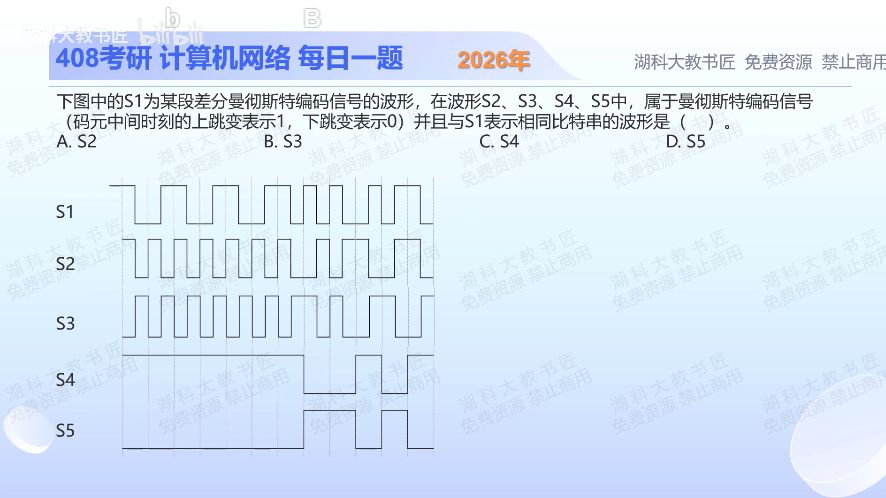

[目录](README.md)　·　[« 2025-1009](1009.md)　·　[2025-1011 »](1011.md)

# 2025-10-10

[原视频](https://www.bilibili.com/video/BV1pNnCzhEku/)

<!-- review-lesson -->

## 先合上解析

只用第一位完成辨认：S1位起点变没变？S3位中点向哪边跳？

展开解析与逐项判断

先排除S4、S5：它们有多个码元连续保持电平，不满足曼彻斯特每位中点必跳变的特征，因此C、D不成立。

差分曼彻斯特按本题教材约定“位边界有跳变表示0，无跳变表示1”，中点跳变只供同步。S1第一位起点延续前面的高电平，无边界跳变，所以第一位是1。题目指定普通曼彻斯特中点上升表示1、下降表示0；S3第一位中点上升，S2下降，据此选 **B（S3）**。沿后续位边界逐位恢复也一致。

千万不要直接把S1中点上升/下降解成1/0：那是把两套编码规则混用。初始电平是判第一位边界变化的参照，图中已给出。

只核对复盘检查

S1起点无跳变，按差分约定为1；S3中点上升也为1，匹配。

## 换一个条件

把S1整个波形高低电平同时反相，差分解出的数据会变吗？普通曼彻斯特固定上升为1时呢？

完成后核对

差分码不变，因为各边界有无跳变不变；固定方向定义的普通曼彻斯特会逐位取反。

关联：[双极性NRZ识别](1006.md)。

[复习入口](../../review/README.md) · 解析已补全，个人是否掌握以独立作答为准。
