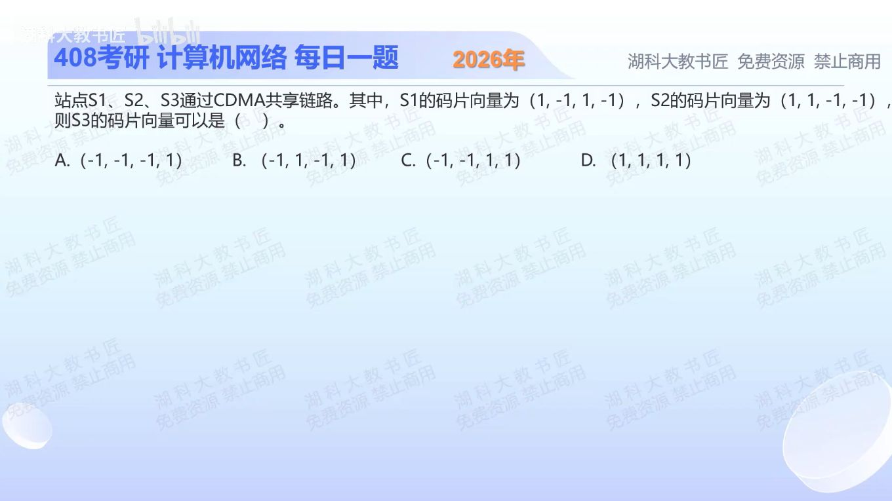

[目录](README.md)　·　[« 2025-1010](1010.md)　·　[2025-1012 »](1015.md)

# 2025-10-11

[原视频](https://www.bilibili.com/video/BV1go47zpEgF/)

<!-- review-lesson -->

## 先合上解析

为什么不能把−S1分配给新站？不看解析算(1,1,1,1)与两站的内积。

展开解析与逐项判断

同步正交CDMA中，不同站码片向量必须两两正交，即对应分量乘积的和为0。长度4时是否再除以4不影响“是否为0”的判断。

逐项与S1、S2做内积：A分别为−2、−2；B分别为−4、0（B正是−S1）；C分别为0、−4（C正是−S2）；D分别为0、0。因此只有 **D** 同时与两站正交。

“看起来不同”不等于正交；一个站码的负向量表示该站发送相反数据，不能给另一个站当独立正交码。

只核对复盘检查

−S1与S1内积为−4而非0，无法正交区分；全1向量与两站内积都为0。

## 换一个条件

S1发送+1、S2发送−1时叠加信号是什么？用S1解相关能恢复什么？

完成后核对

叠加S1−S2=(0,−2,2,0)；与S1内积为4，再除长度4得到+1，其他正交站的贡献为0。

关联：[相关运算与解码](1015.md)。

[复习入口](../../review/README.md) · 解析已补全，个人是否掌握以独立作答为准。
