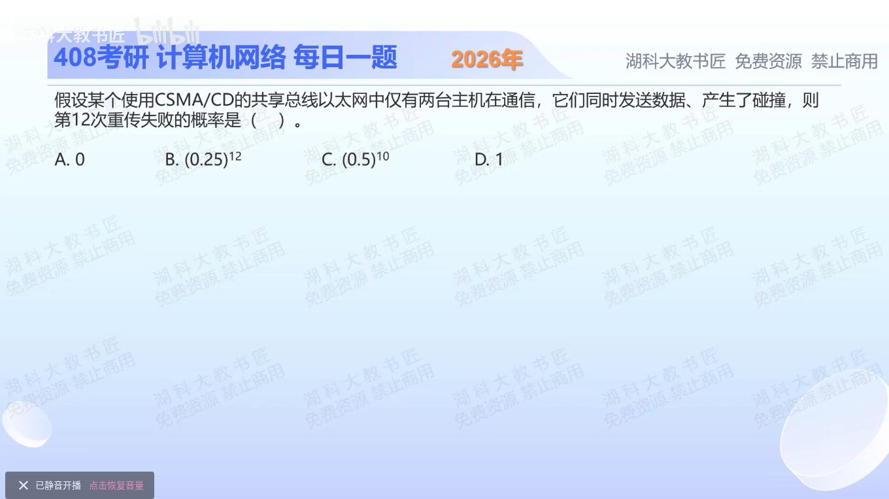

[目录](README.md)　·　[« 2025-1011](1011.md)　·　[2025-1013 »](1013.md)

# 2025-10-12

[原视频](https://www.bilibili.com/video/BV18o47zHECT/)

<!-- review-lesson -->

## 先合上解析

窗口为什么不是2¹²？1024²种选择中，为什么只有1024种会相撞？

展开解析与逐项判断

二进制指数退避在第k次重传前，从0到2^min(k,10)−1中等概率选退避整数。到第12次时窗口已封顶为1024种，不再扩大到4096。

题目按“已到第12次重传，问本次仍冲突”的条件概率理解：两个站只有选到同一整数才会再次同时发送。共有1024²个等可能整数对，其中1024对相同，所以概率1/1024=(0.5)¹⁰，选 **C**。A说不再冲突错误；B既没有使用封顶窗口，也把本次概率与连续失败混淆；D说必冲突错误。

这不是从最初开始一路连续失败到第12次的联合概率。那种问法要把每轮条件概率相乘；本题选项对应本轮概率。

只核对复盘检查

指数在10封顶；相同整数对是(0,0)…(1023,1023)，共1024对。

## 换一个条件

若问第3次重传的本轮碰撞概率呢？

完成后核对

窗口8种，概率8/64=1/8；这是两站独立均匀选择且比较本轮的模型。

关联：[无线DCF退避](0920.md)。

[复习入口](../../review/README.md) · 解析已补全，个人是否掌握以独立作答为准。
