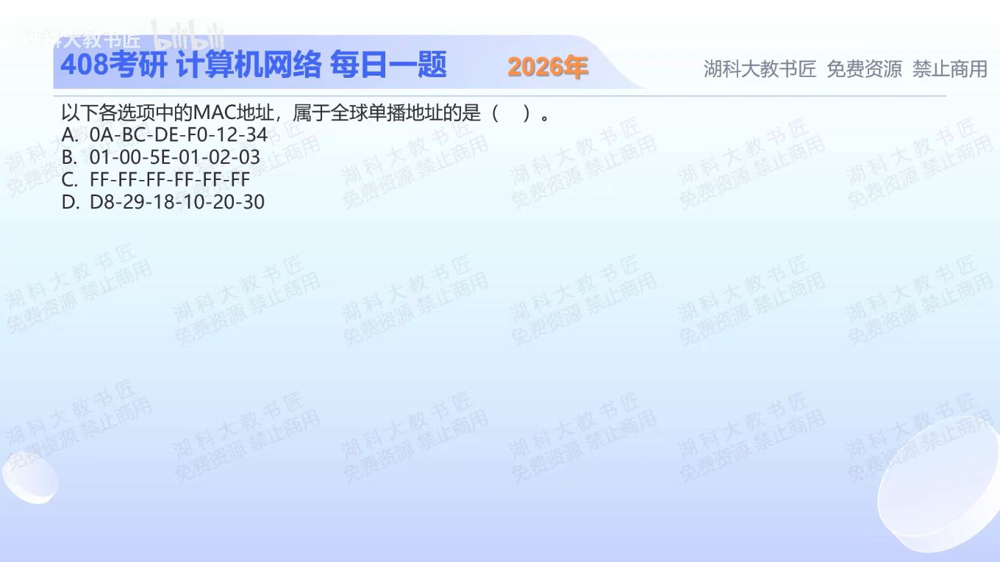

[目录](README.md)　·　[« 2025-1012](1012.md)　·　[2025-1014 »](1014.md)

# 2025-10-13

[原视频](https://www.bilibili.com/video/BV18o47zHEWW/)

<!-- review-lesson -->

## 先合上解析

为什么0A不是全球单播？不要看首字节最左边两位，应看哪两位？

展开解析与逐项判断

只需检查MAC首字节最低两位：最低位I/G为0才是单播；次低位U/L为0才是全局管理。要同时满足，首字节末两位应为00。

A 0A=00001010，单播但U/L=1，是本地管理；B 01=00000001，组播，且属于IPv4组播映射范围；C全FF是广播；D D8=11011000，两位均0，是全局单播，选 **D**。

“全球单播”描述地址类别，不表示它能在互联网跨路由按MAC寻址；MAC仍用于所在链路。

只核对复盘检查

看最低两位；0A末两位10，I/G=0但U/L=1。

## 换一个条件

把D8改成DA，再改成D9，地址类别如何变化？

完成后核对

DA末两位10，是本地单播；D9末两位01，是全局管理的组地址。

关联：[IPv4组播到MAC映射](0918.md)。

[复习入口](../../review/README.md) · 解析已补全，个人是否掌握以独立作答为准。
