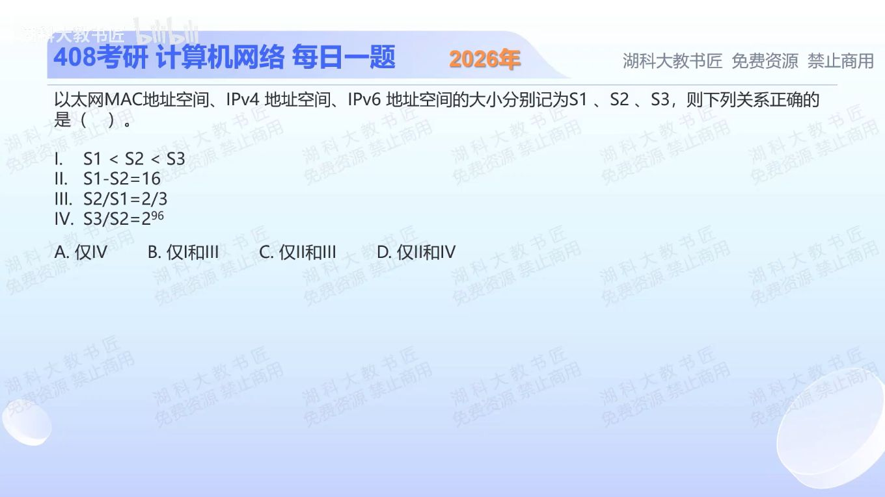

[目录](README.md)　·　[« 2025-1013](1013.md)　·　[2025-1015 »](1015.md)

# 2025-10-14

[原视频](https://www.bilibili.com/video/BV1em47ztEyF/)

<!-- review-lesson -->

## 先合上解析

先写S1、S2、S3再做比较。为什么位数多16不是地址只多16个？

展开解析与逐项判断

“地址空间大小”是可表示地址数量，不是地址长度。以太网MAC为48位，IPv4为32位，IPv6为128位，因此S1=2⁴⁸、S2=2³²、S3=2¹²⁸。

Ⅰ实际应是S2<S1<S3，错；Ⅱ差为2⁴⁸−2³²而不是48−32=16，错；Ⅲ比为2³²/2⁴⁸=2⁻¹⁶，不是32/48=2/3，错；ⅣS3/S2=2^(128−32)=2⁹⁶，对。只有Ⅳ正确，选 **A**；B、C、D都包含错误陈述。

这里是理论编码空间，未扣除各协议保留地址，不要把“理论空间”又替换为“实际可分配主机数”。

只核对复盘检查

每增加1位，编码数量翻倍；多16位是数量乘2¹⁶。

## 换一个条件

一个地址从12位扩展到20位，理论地址空间扩大多少倍？

完成后核对

2^(20−12)=256倍，不能用20/12或20−12当倍率。

关联：[IPv6基础性质](0919.md)。

[复习入口](../../review/README.md) · 解析已补全，个人是否掌握以独立作答为准。
