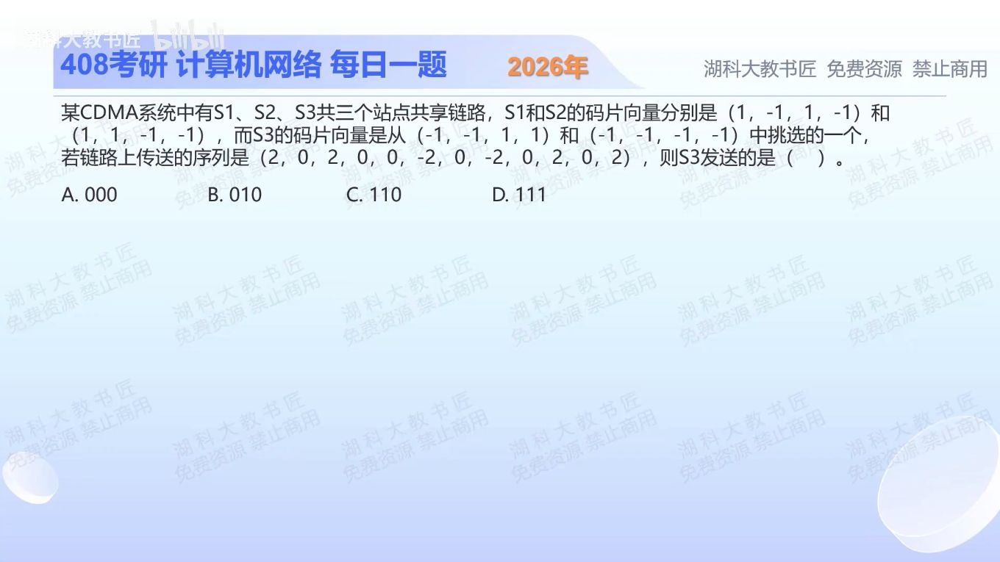

[目录](README.md)　·　[« 2025-1014](1014.md)　·　[2025-1016 »](1016.md)

# 2025-10-15

[原视频](https://www.bilibili.com/video/BV1em47ztEsJ/)

<!-- review-lesson -->

## 先合上解析

遮住答案，先排除一个候选码，再列三次归一化内积。

展开解析与逐项判断

先选合法的S3码。候选(−1,−1,1,1)是−S2，与S2不正交；因此S3只能为(−1,−1,−1,−1)，它与S1、S2的内积均0。

把收到的12个码片每4个一组：(2,0,2,0)、(0,−2,0,−2)、(0,2,0,2)。分别与S3做内积再除以4，得到−1、+1、−1。按+1表示数据1、−1表示数据0，恢复 **010，选B**。A漏掉中间的正相关，C错第一位，D将负相关也当1。

先判码是否合法，再相关解码；不能随意用任一候选向量“试出”选项。

只核对复盘检查

排除−S2；使用全−1向量，结果−1、+1、−1，对应010。

## 换一个条件

若第二组收到(0,0,0,0)，能直接把该位判成数据0吗？

完成后核对

不能。在理想正交模型中相关结果0表示该站这一时隙未发送；数据0应给出−1。真实噪声场景还要结合判决阈值和模型。

关联：[正交码分配](1011.md)。

[复习入口](../../review/README.md) · 解析已补全，个人是否掌握以独立作答为准。
