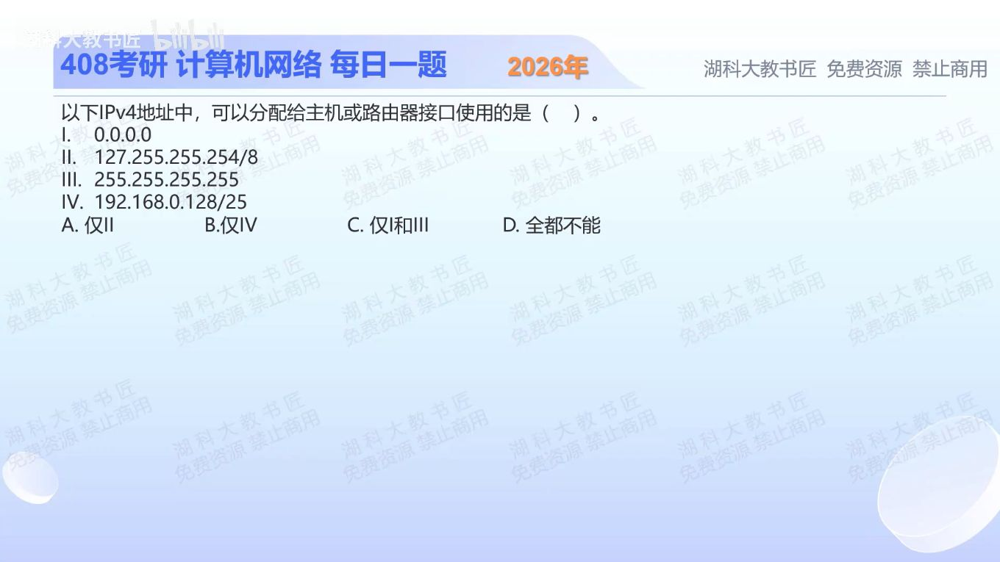

[目录](README.md)　·　[« 2025-1015](1015.md)　·　[2025-1017 »](1017.md)

# 2025-10-16

[原视频](https://www.bilibili.com/video/BV1em47ztECg/)

<!-- review-lesson -->

## 先合上解析

192.168.0.128/25的7个主机位是什么？127段有哪些地址属于环回？

展开解析与逐项判断

按普通IPv4接口分配规则逐项排除。Ⅰ0.0.0.0是未指定地址，可在尚未获址时用作源地址，但不是正常分配的接口地址。Ⅱ整个127.0.0.0/8用于环回，不只是127.0.0.1，不能作普通外部接口地址。Ⅲ255.255.255.255是受限广播地址。Ⅳ/25把末字节分成两半，192.168.0.128是后半子网的网络地址，主机位全0。

所以四项都不能按题意分配，选 **D**；A误把环回段当普通主机，B误把网络地址当主机，C包含未指定与广播。

本题的“接口”指普通网络通信接口；特殊实现的环回配置不应混入这类基础地址分配题。

只核对复盘检查

主机位全0；整个127/8都是环回保留段。

## 换一个条件

192.168.0.128改成/24后，是普通可用主机地址吗？

完成后核对

是，/24主机位是末8位10000000，既非全0也非全1；同一数值在不同掩码下角色可变。

关联：[私有性与广播判断](0930.md)；[CIDR主机分配](1017.md)。

[复习入口](../../review/README.md) · 解析已补全，个人是否掌握以独立作答为准。
