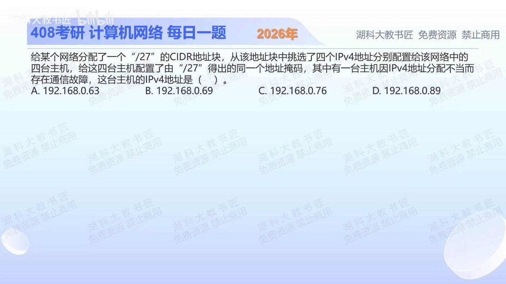

[目录](README.md)　·　[« 2025-1016](1016.md)　·　[2025-1018 »](1018.md)

# 2025-10-17

[原视频](https://www.bilibili.com/video/BV19m47ztE8J/)

<!-- review-lesson -->

## 先合上解析

写出包含.69的/27网络、广播和主机范围。为什么.63有两重问题？

展开解析与逐项判断

/27剩5位主机位，块大小32；末字节边界是0、32、64、96……。B .69、C .76、D .89都在192.168.0.64/27中，网络地址.64，广播.95，可用.65—.94。

A .63落在前一个.32/27子网，而且正是该子网的广播地址，既不属于其余三台的子网，也不能当普通主机，选 **A**。判断不能用“同为192.168.0开头”代替掩码计算。

题干声称从同一块中挑选四个地址，与.63的实际归属有冲突；这恰是要识别的错误配置，而非接受它后忽略掩码。

只核对复盘检查

网络.64，广播.95，主机.65—.94；.63是上一块广播，又不在当前块内。

## 换一个条件

把A改成.64、再改成.65，故障原因如何变化？

完成后核对

.64属于同块但为网络地址，仍不可分配；.65是同块可用主机地址。

关联：[静态路由与直连](1020.md)；[接口可分配地址](1016.md)。

[复习入口](../../review/README.md) · 解析已补全，个人是否掌握以独立作答为准。
