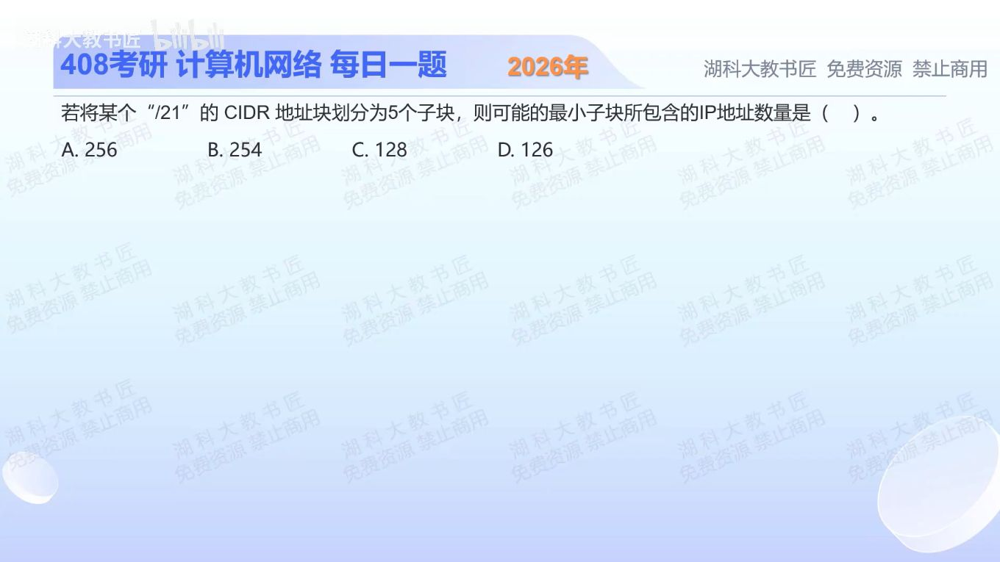

[目录](README.md)　·　[« 2025-1017](1017.md)　·　[2025-1019 »](1019.md)

# 2025-10-18

[原视频](https://www.bilibili.com/video/BV1e147zfEm7/)

<!-- review-lesson -->

## 先合上解析

画四次二分，解释为什么要5块却只分4次。最后一对小块各有多少地址？

展开解析与逐项判断

/21共有2¹¹=2048个IP地址。按“把整个地址块完整划成5个CIDR子块”的通常含义，每次二分一个块，子块数增加1。要让其中一个尽量小，就连续沿同一分支二分4次，得到/22、/23、/24、/25、/25。

数量分别1024、512、256、128、128，加起来2048。因此可能的最小子块含 **128个地址，选C**。A不是能达到的最小值；B、D分别把256、128减2，混成“可分配普通主机数”。题目问地址数量，无须扣网络和广播。

完整划分是关键。如果允许只挑5个小块并留下大量空间不用，最小块会有不同答案。

只核对复盘检查

初始1块，每次多1块，4次得5块；最深/25各128个。

## 换一个条件

若/21完整划成6个CIDR子块，最小一块可含多少地址？

完成后核对

沿同一路径二分5次可到/26，64个；其他兄弟块保留，数量合计仍2048。

关联：[主机位与地址块](1017.md)。

[复习入口](../../review/README.md) · 解析已补全，个人是否掌握以独立作答为准。
