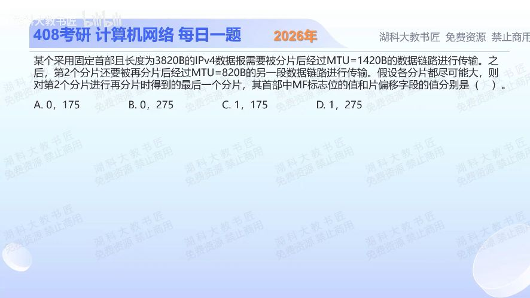

[目录](README.md)　·　[« 2025-1018](1018.md)　·　[2025-1020 »](1020.md)

# 2025-10-19

[原视频](https://www.bilibili.com/video/BV1v147zfEVP/)

<!-- review-lesson -->

## 先合上解析

只列三个量：原第二片起点、再分片增加的偏移、它后面是否还有原数据。

展开解析与逐项判断

原IPv4总长3820B，固定首部20B，数据3800B。第一链路MTU1420，每片可装1400B数据，且1400是8的倍数；得到数据1400、1400、1000的三片。第二片覆盖原数据字节1400—2799，MF=1，因为后面还有原第三片。

第二片再过MTU820链路，数据容量800B，拆成800B和600B。问其最后一小片：起点在原数据的1400+800=2200B，片偏移2200/8=275；它虽然是“第二片内部的最后一片”，后面仍有原第三片，MF仍1。所以选 **D（1，275）**。

A、B误把局部最后片当全报文最后片；C把偏移停在原第二片的1400/8=175，没有加再分片位移。所有偏移都相对原始数据起点，不是相对子片。

只核对复盘检查

1400B、800B、仍有原第三片；故偏移275，MF=1。

## 换一个条件

若把原第三片1000B数据也按MTU820拆开，其最后一片MF和偏移是多少？

完成后核对

原第三片起点2800，加800得到3600，偏移450；这次确实到整报文结尾，MF=0，末片数据200B。

关联：[封装后的IPv4分片](1026.md)。

[复习入口](../../review/README.md) · 解析已补全，个人是否掌握以独立作答为准。
