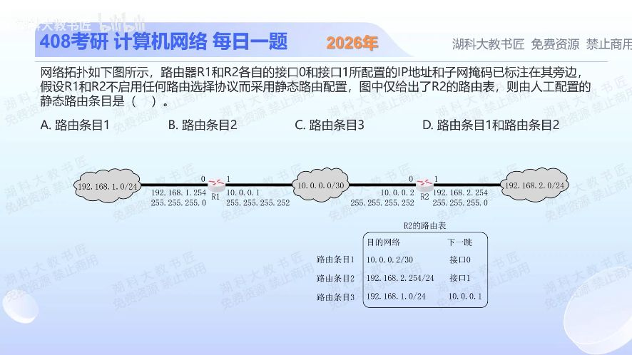

[目录](README.md)　·　[« 2025-1019](1019.md)　·　[2025-1021 »](1021.md)

# 2025-10-20

[原视频](https://www.bilibili.com/video/BV1R147zfERf/)

<!-- review-lesson -->

## 先合上解析

站在R2看图，哪些网络有自己的接口直接连着？去左侧LAN的下一跳为何不是192.168.1.254？

展开解析与逐项判断

题目问路由条目的来源，不是查表的最长匹配。R2接口0连10.0.0.0/30，接口1连192.168.2.0/24；这两个直连网络会随接口配置进入路由表，不需要逐条手工配静态路由。

R2要去192.168.1.0/24，必须经R1的10.0.0.1；在明确未启用动态路由协议时，这条远端路由需要人工配置。因此条目3是静态路由，选 **C**。A、B分别选了直连项，D同时选了两个直连项。

截图在“目的网络”栏以10.0.0.2/30、192.168.2.254/24写接口地址/前缀；规范化网络应分别是10.0.0.0/30、192.168.2.0/24。别因此误判为另一类网络。

只核对复盘检查

两条直连是10.0.0.0/30与192.168.2.0/24；下一跳需在本地可达链路上，取邻居R1的10.0.0.1。

## 换一个条件

若两路由器启用OSPF并通告各自LAN，到192.168.1.0/24的路由一定还需人工配置吗？

完成后核对

不需要，可由OSPF学习。目的网络相同，不代表路由来源相同；直连、静态、动态是来源分类。

关联：[OSPF更新](0928.md)；[路由器接收后是否转发](0925.md)。

[复习入口](../../review/README.md) · 解析已补全，个人是否掌握以独立作答为准。
