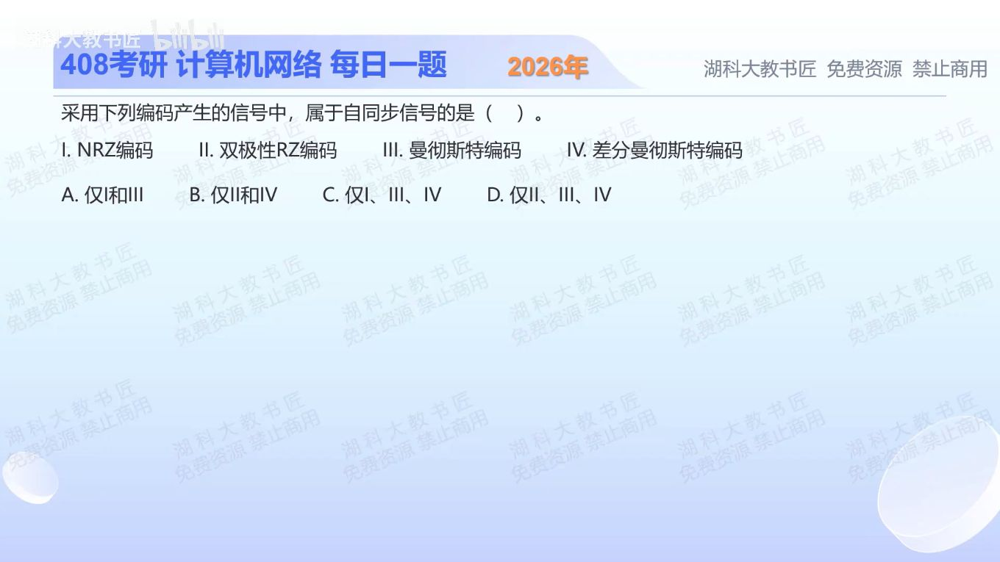

[目录](README.md)　·　[« 2025-1020](1020.md)　·　[2025-1022 »](1022.md)

# 2025-10-21

[原视频](https://www.bilibili.com/video/BV1Qps3zYEmR/)

<!-- review-lesson -->

## 先合上解析

用连续十个1或0检验各编码：有没有规则保证每位仍可找到时钟线索？

展开解析与逐项判断

自同步要求信号自身能提供足够规律的跳变来恢复码元时钟。ⅠNRZ连续同值可能长期不跳变，因此不能保证自同步。Ⅱ题中的双极性RZ每位有效电平后都回零，产生周期性时序线索。Ⅲ普通曼彻斯特、Ⅳ差分曼彻斯特每位中点均强制跳变，也能同步。

正确为Ⅱ、Ⅲ、Ⅳ，选 **D**。A、C含不能保证同步的NRZ；B漏了双极性RZ和普通曼彻斯特、且错含NRZ。

这里“双极性RZ”指1与0分别用正、负脉冲且均回零的本题模型；不要混成遇连续0没有脉冲的另一种线路码定义。

只核对复盘检查

NRZ没有；双极性RZ每位回零，两种曼彻斯特码每位中点跳变。

## 换一个条件

普通曼彻斯特连续传十个1，能因数据不变而一直保持高电平吗？

完成后核对

不能。每位中点仍必须按编码约定跳变，所以数据重复与波形恒定不是一回事。

关联：[具体波形识别](1006.md)；[曼彻斯特转换](1010.md)。

[复习入口](../../review/README.md) · 解析已补全，个人是否掌握以独立作答为准。
