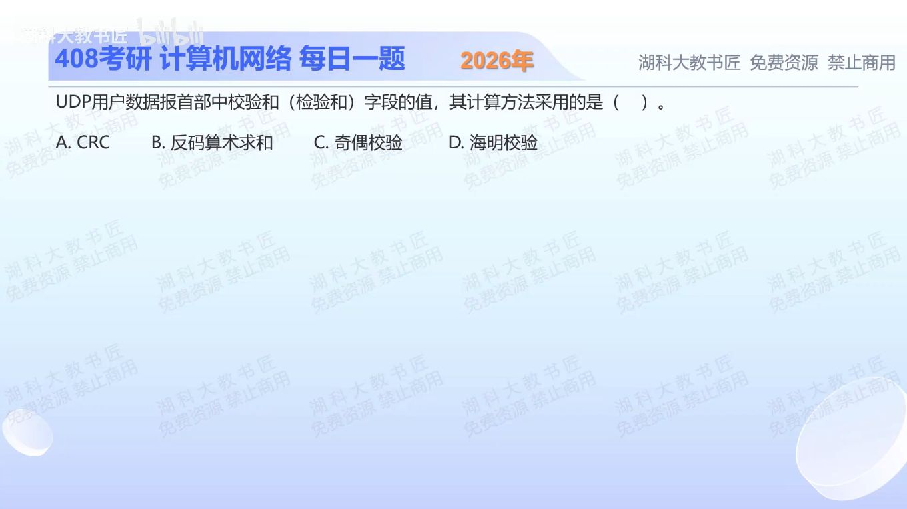

[目录](README.md)　·　[« 2025-1021](1021.md)　·　[2025-1023 »](1023.md)

# 2025-10-22

[原视频](https://www.bilibili.com/video/BV1gts3zcEgH/)

<!-- review-lesson -->

## 先合上解析

最高位进位怎么处理？计算范围为什么不仅是应用数据？

展开解析与逐项判断

UDP检验和用16位反码算术求和：把伪首部、UDP首部（计算时检验和位置置0）和数据按16位分组，相加时把最高位溢出的进位加回低位，最后对结果逐位取反。数据为奇数字节时计算上补一个零字节，补零不作为数据发送。

所以选 **B**。A CRC使用模2多项式除法；C奇偶校验只约束1的数量奇偶；D海明码通过多组校验定位错误，都不是UDP检验和算法。

“UDP不保证可靠传输”不等于“UDP没有差错检测”。IPv4中可不启用UDP检验和；IPv6通常要求使用，少数标准定义的特殊隧道例外不作为本题常规情况。

只核对复盘检查

进位回卷相加；覆盖伪首部、UDP首部与数据，伪首部帮助检测投递到错误地址/协议的情况。

## 换一个条件

只有两个16位字0xFFFF和0x0001（忽略其他字段）的反码和及取反结果是什么？

完成后核对

普通和0x10000；回卷后0x0001；取反0xFFFE。不是截断成0再取反。

关联：[校验覆盖范围](0924.md)。

取证边界：[RFC 768](https://www.rfc-editor.org/rfc/rfc768.html)定义UDP检验和。

[复习入口](../../review/README.md) · 解析已补全，个人是否掌握以独立作答为准。
