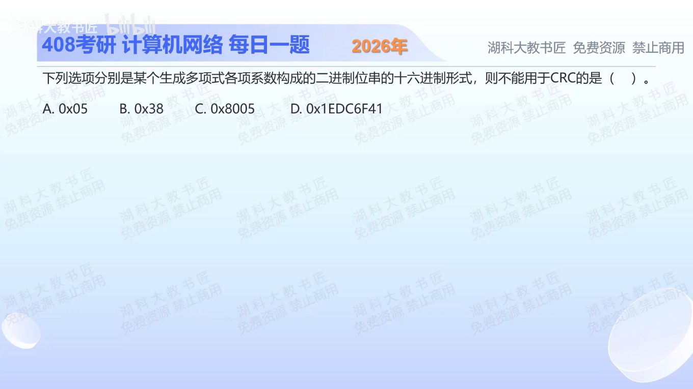

[目录](README.md)　·　[« 2025-1022](1022.md)　·　[2025-1024 »](1024.md)

# 2025-10-23

[原视频](https://www.bilibili.com/video/BV13xs3zaEV9/)

<!-- review-lesson -->

## 先合上解析

只看哪个十六进制位就能检查常数项？为什么0x38的问题与最高位前面的零无关？

展开解析与逐项判断

CRC生成多项式在教材的通常要求下，最高次项和常数项系数都为1；十六进制表示无论是否约定省略最高项，常数项仍由最低位决定。最低位为0即常数项为0，不满足本题要求。

A 0x05末位二进制1；B 0x38=00111000，末位0；C 0x8005末位1；D 0x1EDC6F41末位1。因此不能使用的是 **B**。不需要把长十六进制数逐位展开，更不需要真的对数据做CRC除法。

这是合法性筛选，不代表所有末位1的多项式检错能力一样，也不代表任意一种都适合任意协议。

只核对复盘检查

只看最低十六进制数的奇偶；8为偶数，最低位0。前导零不改变多项式，缺常数项才是问题。

## 换一个条件

0x13与0x12哪个通过本题的常数项检查？0x13对应什么多项式？

完成后核对

0x13通过、0x12不通过；若按完整系数串10011解释，0x13对应x⁴+x+1。

关联：[CRC余数运算](1024.md)。

[复习入口](../../review/README.md) · 解析已补全，个人是否掌握以独立作答为准。
