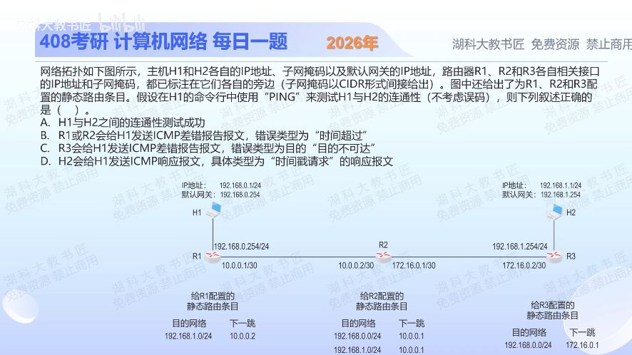

[目录](README.md)　·　[« 2025-1023](1023.md)　·　[2025-1025 »](1025.md)

# 2025-10-24

[原视频](https://www.bilibili.com/video/BV1Dxs3zhE4q/)

<!-- review-lesson -->

## 先合上解析

在图上只追踪去192.168.1.1的下一跳，找出首次回到旧路由器的地方。什么字段阻止无限转圈？

展开解析与逐项判断

沿目的地址192.168.1.1逐跳查表：H1发给默认网关R1；R1到192.168.1.0/24的下一跳是10.0.0.2，即R2；但R2该目的的下一跳被错配为10.0.0.1，又送回R1。因此在R1、R2之间形成环路，TTL随转发递减，最终某个路由器丢包并向H1返回ICMP时间超时报文，选 **B**。

A不会成功，包到不了H2；C说R3报告不可达，但包根本到不了R3；D不仅到不了H2，而且ping使用回送请求/回答，不是时间戳请求/回答。

排障要检查目的方向的每一跳；“各自都有一条到目标网络的表项”不代表这些表项连接成正确路径。

只核对复盘检查

R1→R2→R1；TTL递减至转发不能继续时丢弃并报告超时。

## 换一个条件

把R2到192.168.1.0/24的下一跳改成172.16.0.2，图中的回程是否也具备路由？

完成后核对

具备：H2→R3，R3到192.168.0.0/24经172.16.0.1到R2，R2经10.0.0.1到R1，再直连H1；题设无其他故障时ping可通。

关联：[静态与直连路由](1020.md)；[TTL与traceroute](0927.md)。

[复习入口](../../review/README.md) · 解析已补全，个人是否掌握以独立作答为准。
