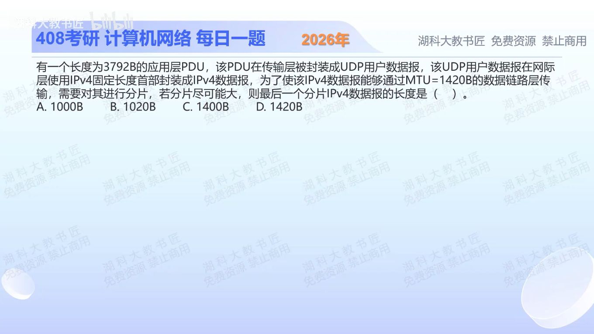

[目录](README.md)　·　[« 2025-1025](1025.md)　·　[2025-1027 »](1027.md)

# 2025-10-26

[原视频](https://www.bilibili.com/video/BV1Rjs3zqEUj/)

<!-- review-lesson -->

## 先合上解析

从3792开始按层列出3800、3820、1400、1020各代表什么。

展开解析与逐项判断

分片对象是IPv4的数据部分。3792B应用数据先加8B UDP首部，得到3800B的IP数据；IP首部20B另算。MTU1420允许每片数据最多1400B，恰好按8B对齐。

3800=1400+1400+1000，所以最后片数据1000B，但题目问IPv4数据报的总长度，还须加自己的20B首部，得 **1020B，选B**。A漏最后片IP首部；C是前两片的数据长；D是前两片总长。

UDP首部只在原IP数据起始位置出现一次，不给每个IP分片重加8B。每片有IP首部，不等于每片都有UDP首部。

只核对复盘检查

3800为UDP数据报/IP载荷，3820为原IP总长，1400为非末片载荷，1020为末片总长。

## 换一个条件

若MTU改成1500B，每个非末片载荷能装1480B，最后片总长是多少？

完成后核对

3800−2×1480=840B，末片总长860B；1480已是8的倍数。

关联：[分片再分片的偏移](1019.md)。

[复习入口](../../review/README.md) · 解析已补全，个人是否掌握以独立作答为准。
