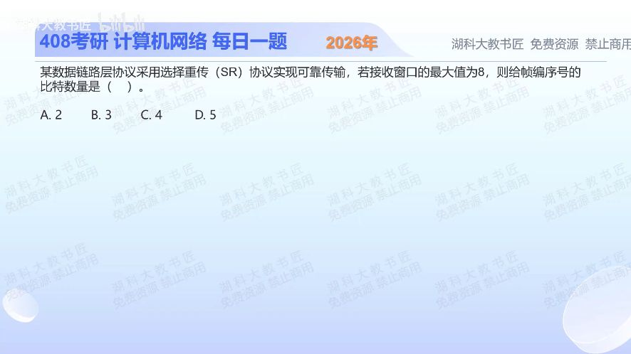

[目录](README.md)　·　[« 2025-1026](1026.md)　·　[2025-1028 »](1028.md)

# 2025-10-27

[原视频](https://www.bilibili.com/video/BV1XJs3zvEdp/)

<!-- review-lesson -->

## 先合上解析

为什么要把8变成16再求编号位数？画出两个不重叠的8个序号窗口。

展开解析与逐项判断

按常规SR对称窗口模型，发送和接收窗口均不能超过序号空间的一半：Wmax=2^(n−1)。否则序号绕回后，新接收窗口会与仍可能重传的旧帧序号重叠。

题给接收窗口最大值8，2^(n−1)=8，得n=4，选 **C**。A只能支持最大2；B最大4；D的最大值是16，和“最大值为8”不符。

这个一半结论对应教材常用相等窗口设置；更一般的不等窗口分析需检查发送、接收窗口之和不超过序号空间，不可拿本题一句话覆盖所有协议参数。

只核对复盘检查

旧发送窗口和新接收窗口需要区分，至少16个序号，0—7与8—15，因此4位。

## 换一个条件

使用5位序号的对称SR，最大窗口是多少？同为5位的GBN呢？

完成后核对

SR最多16；GBN最多31。两协议接收乱序帧的机制不同，不能共用窗口上界。

关联：[GBN编号](1025.md)；[最大利用率比较](1028.md)。

[复习入口](../../review/README.md) · 解析已补全，个人是否掌握以独立作答为准。
