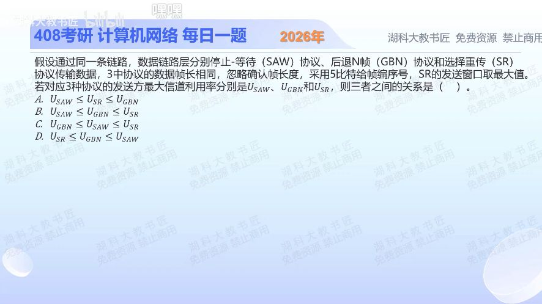

[目录](README.md)　·　[« 2025-1027](1027.md)　·　[2025-1029 »](1029.md)

# 2025-10-28

[原视频](https://www.bilibili.com/video/BV12csmzsEwA/)

<!-- review-lesson -->

## 先合上解析

为什么SR虽然重传更精细，这题仍不能排在GBN上面？什么时候三者可以相等？

展开解析与逐项判断

本题问同链路、同帧长下的最大发送利用率，按无差错理想上限比较。5位序号给32个编号；停止等待窗口1，SR最大窗口16，GBN最大窗口31。

忽略ACK长度，窗口为W时U=min(1, W·T帧/(T帧+RTT))。分母相同，利用率随窗口单调不减，因此 **U_SAW≤U_SR≤U_GBN，选A**。B把SR与GBN顺序反了；C把GBN放到停止等待以下；D完全倒序。

不等号允许等号：窗口已经填满链路时，再增大窗口仍是100%。这里不能用“SR遇错误只重传丢失帧，所以一定更高效”回答；那是含差错重传代价的另一种条件。

只核对复盘检查

题目比较理想最大值且相同序号位数，GBN可用窗口更大；RTT为0等使停止等待已饱和的理想情况下均可达1。

## 换一个条件

若RTT=19T帧，三种最大利用率各是多少？

完成后核对

分别1/20=5%、16/20=80%、min(1,31/20)=100%。

关联：[窗口上界](1025.md)；[SR](1027.md)。

[复习入口](../../review/README.md) · 解析已补全，个人是否掌握以独立作答为准。
